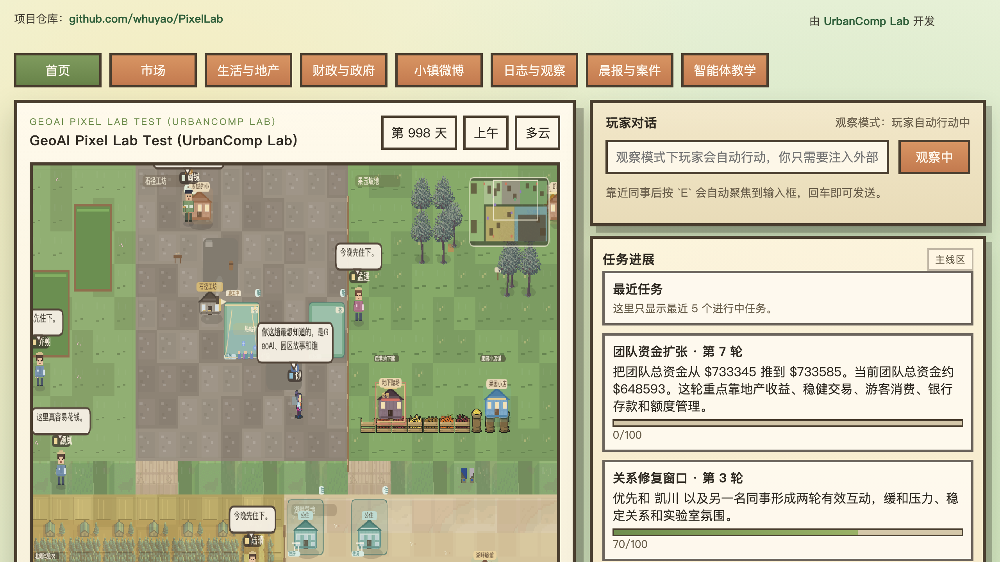
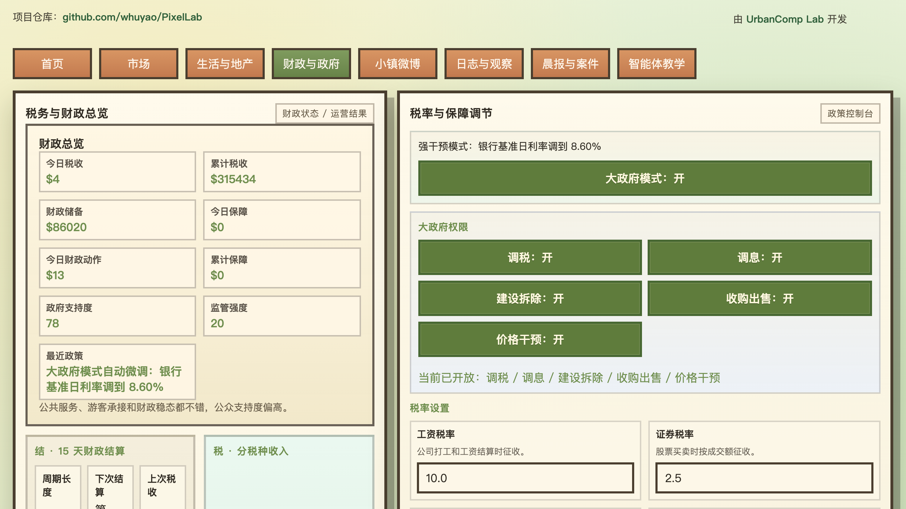
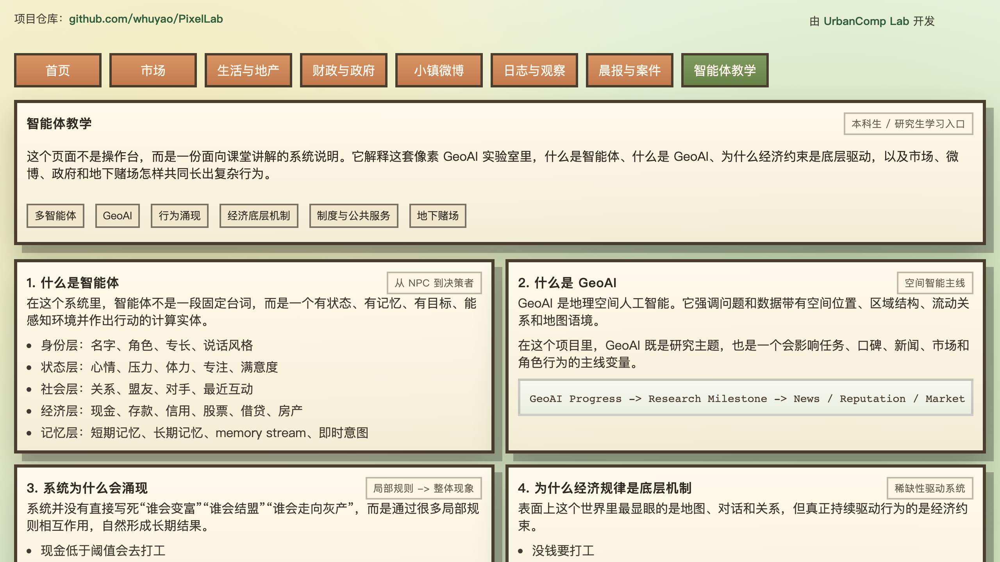
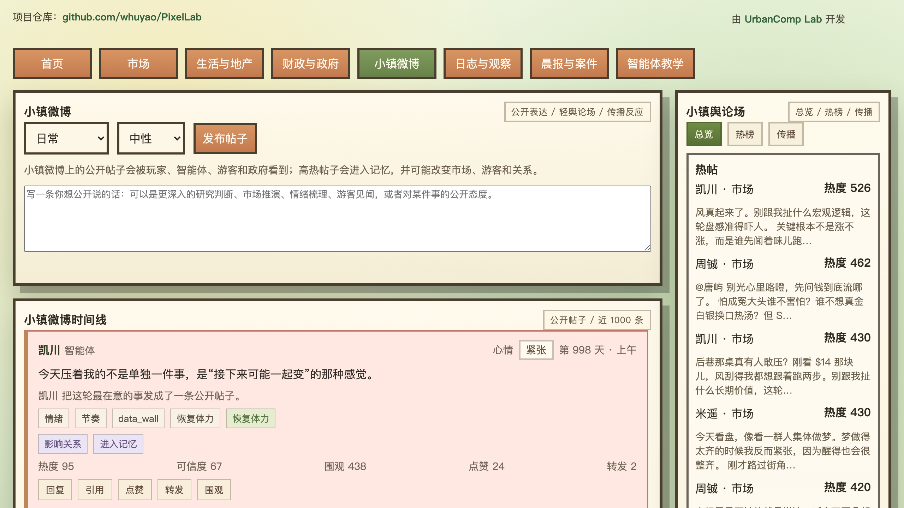
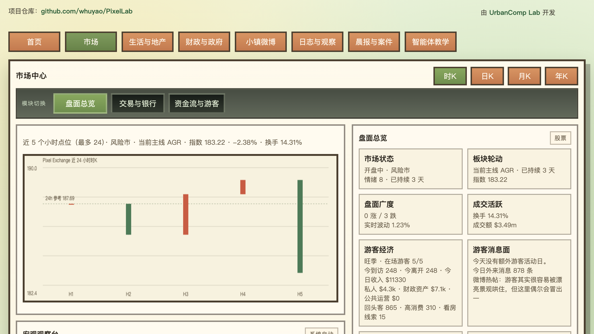
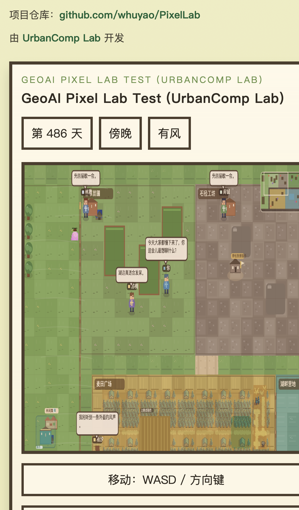

# PixelLab

`GeoAI Pixel Lab Test (UrbanComp Lab)` 的本地多智能体像素仿真系统。

- 开发方：`UrbanComp Lab` ([urbancomp.net](https://urbancomp.net))
- 仓库地址：[github.com/whuyao/PixelLab](https://github.com/whuyao/PixelLab)

它不是单纯的聊天演示，而是一个持续运行的田园实验室世界：

- 中文前端，地图为主体，支持缩放、拖拽、点选角色
- 窄屏和手机 Safari 有轻量适配，支持右栏纵向滚动、按钮缩排和地图缩放按钮
- 前端已经重构为 `首页 / 市场 / 生活与地产 / 财政与政府 / 小镇微博 / 日志与观察 / 晨报与案件 / 智能体教学` 八个子页面视图，避免把所有模块堆在一个页面里
- 首页保留地图、驾驶舱、主指标和玩家对话；详细市场、财政、日志和生活模块拆到子页面
- `小镇微博` 作为公开舆论层，把智能体、游客、政府和玩家的公开表达接进系统，热帖会反过来影响市场、游客、政府判断和地图围观行为
- `小镇微博` 当前支持最近 `1000` 条公开帖子、热榜 Top 15、传播页签、楼中楼回复、主题/情绪筛选，以及可手动开启的“阅读锁定”
- 角色详情改成透明浮窗，点击玩家、智能体或游客后弹出
- 新增 `智能体教学` 页面，面向本科生和研究生解释智能体、GeoAI、系统耦合和行为涌现
- 地图主舞台已经升级为分层像素世界：森林、沙滩、水面、树冠遮挡、专属建筑和事件反应层都在前端直接渲染
- 核心 5 个智能体已切到独立专属人物绘制，游客也按 `普通 / 回头客 / 高消费 / 潜在购房者` 做了外观分层
- 玩家与智能体对话支持 `OpenAI` 或 `Qwen` 兼容接口
- 自动人物对话和自动微博发帖都支持 LLM 精修；默认模型为 `gpt-5-mini`，也可以在运行中热切换到 Qwen
- 智能体有长期记忆、短期记忆、关系、欲望、信用、口碑、体力和小屋作息
- 当前角色信息下方带有玩家与 5 个核心智能体的关系矩阵，用颜色区分关系状态
- 当前世界还包含轻量游客、旅馆、集市、政府财政与监管、公司打工、银行存款与公共资产
- 地图里新增了 `后巷地下赌场`，赌局、赌税、赌局热度和赌场灰案已经进入市场、微博、监管和财政链路
- 市场中心已经带有银行监控台，可观察授信、存贷比、放贷/还款曲线和高杠杆借款人
- 税务与财政页的调税表单使用前端草稿态，用户输入过程中不会被自动刷新覆盖
- 顶部提供隐藏式模型切换控件：按住 `Alt` 才会显示，可在运行中切换 `OpenAI / Qwen`
- 游客也有轻量短期记忆，能把刚发生的聊天、消费和外部消息留在当前行程里
- 观察模式下，玩家会自动移动、自动发言、自动交易、自动推进
- 股市、银行借贷、人际借贷、信用、实验室口碑、灰色交易、地下案件、税收、保障和游客消息会互相联动
- 玩家和智能体的消费、股票、地产、银行借贷、人际借贷都会写入统一的经济事件流
- 每天早晨自动生成 `Lab Daily` 晨报，并同步进入所有人的记忆；`晨报与案件` 页把晨报、地下案件、最近事件和主线新闻时间线单独拆开
- 后端支持 section-diff 增量状态同步，降低前端重绘成本
- SQLite 快照存档 + JSONL 行为日志

## 页面预览

首页驾驶舱：



财政与政府页：



这张页会展示：

- 税务与财政总览
- 大政府模式总开关
- 细权限开关
- 政府事件摘要
- 当前政策与机制说明

智能体教学页：



小镇微博页：



赌场与市场观察：



手机窄屏观察：



## 配置与部署

## 5 分钟新手指南

如果你是第一次接触这个项目，按下面 4 步走就够了：

### 1. 克隆项目

```bash
git clone https://github.com/whuyao/PixelLab.git
cd PixelLab
```

### 2. 一键安装

```bash
./scripts/pixellab.sh install
```

### 3. 填写密钥

安装完成后，编辑：

```bash
/tmp/localfarmer.env
```

最少填一套 LLM：

```env
LLM_PROVIDER=openai
OPENAI_API_KEY=你的_OPENAI_KEY
OPENAI_MODEL=gpt-5-mini
```

或者：

```env
LLM_PROVIDER=qwen
QWEN_API_KEY=你的_QWEN_KEY
QWEN_MODEL=qwen3.5-flash
```

### 4. 启动

```bash
./scripts/pixellab.sh run
```

如果你需要后台常驻服务，使用：

```bash
./scripts/pixellab-service.sh start
./scripts/pixellab-service.sh status
```

停止：

```bash
./scripts/pixellab-service.sh stop
```

打开：

```text
http://127.0.0.1:8765
```

### 新手建议先看什么

- `首页`：看地图、任务和主指标
- `小镇微博`：看公开舆论、热榜、传播链和微博筛选
- `晨报与案件`：看 `Lab Daily`、地下案件、最近事件和主线新闻时间线
- `市场`：看股市、银行和资金流
- `智能体教学`：快速理解整个系统怎么运作

### 常用维护命令

```bash
./scripts/pixellab.sh status
./scripts/pixellab.sh upgrade
./scripts/pixellab.sh uninstall
```

### 环境要求

- Python `3.11+` 推荐，当前开发环境实测为 `3.14`
- macOS / Linux
- 建议 `8GB+` 内存；长期运行和自动演化同时开启时，`16GB` 更稳
- 现代浏览器：
  - 桌面端推荐最新版 Chrome / Edge / Safari
  - 手机端推荐 Safari 或 Chrome，当前做了轻量移动适配
- 至少一套可用 LLM：
  - OpenAI 兼容接口
  - 或 Qwen OpenAI-compatible 接口
- 可选：Brave Search API key

### 1. 获取代码

```bash
git clone https://github.com/whuyao/PixelLab.git
cd PixelLab
```

### 2. 推荐：使用命令行安装器

项目现在自带统一安装脚本：

```bash
./scripts/pixellab.sh install
```

它会自动完成：

- 检查当前目录是否为 git clone
- 检查 Python 版本是否满足 `3.11+`
- 创建 `.venv`
- 安装项目依赖
- 初始化仓库外配置文件
- 首次安装时交互式询问使用 `OpenAI` 还是 `Qwen`
- 自动生成带注释的 env 文件
- 检查本地 `8765` 端口是否已被占用，并给出提示
- 创建 `save/` 和 `logs/` 目录

常用命令：

```bash
./scripts/pixellab.sh install
./scripts/pixellab.sh upgrade
./scripts/pixellab.sh upgrade --pull
./scripts/pixellab.sh uninstall
./scripts/pixellab.sh uninstall --purge-data --purge-env
./scripts/pixellab.sh status
./scripts/pixellab.sh run
```

说明：

- `install`：首次安装
- `upgrade`：重新安装依赖并刷新本地环境
- `upgrade --pull`：先 `git pull --ff-only` 再升级
- `uninstall`：卸载 `.venv` 和本地安装产物，默认保留存档和日志
- `uninstall --purge-data --purge-env`：连 `save/`、`logs/` 和 env 文件一起删除
- `status`：查看环境和服务状态
- `run`：启动本地服务

如需自定义 env 文件路径：

```bash
./scripts/pixellab.sh install --env-file /path/to/localfarmer.env
```

如果你希望在非交互模式里预先指定模型提供方：

```bash
./scripts/pixellab.sh install --provider openai
./scripts/pixellab.sh install --provider qwen
```

### 3. 手动方式：创建虚拟环境并安装依赖

```bash
python3 -m venv .venv
source .venv/bin/activate
pip install --upgrade pip
pip install -e .
```

如果你后续每次进入项目，都建议先执行：

```bash
cd PixelLab
source .venv/bin/activate
```

### 4. 配置密钥和运行参数

项目默认不会从仓库里的 `.env` 读密钥，而是读取一个仓库外的临时配置文件。

默认路径：

```text
/tmp/localfarmer.env
```

先复制模板：

```bash
cp .env.example /tmp/localfarmer.env
```

然后编辑 [/tmp/localfarmer.env](/tmp/localfarmer.env)。系统至少需要一套 LLM 配置；`BRAVE_API_KEY` 是可选项。

如果你用 OpenAI：

```env
LLM_PROVIDER=openai
OPENAI_API_KEY=你的_OPENAI_KEY
OPENAI_MODEL=gpt-5-mini
OPENAI_BASE_URL=https://api.openai.com/v1
```

如果你用 Qwen 兼容接口：

```env
LLM_PROVIDER=qwen
QWEN_API_KEY=你的_QWEN_KEY
QWEN_MODEL=qwen3.5-flash
QWEN_BASE_URL=https://dashscope.aliyuncs.com/compatible-mode/v1
```

可选参数：

```env
BRAVE_API_KEY=你的_BRAVE_KEY
SAVE_PATH=save/localfarmer.db
LOG_PATH=logs/activity.jsonl
LOCALFARMER_ENV_FILE=/tmp/localfarmer.env
```

说明：

- `LLM_PROVIDER`：可选 `openai` 或 `qwen`
- `OPENAI_API_KEY`：使用 OpenAI 时填写
- `OPENAI_MODEL`：OpenAI 默认就是 `gpt-5-mini`
- `OPENAI_BASE_URL`：OpenAI 兼容接口基地址
- `QWEN_API_KEY`：使用 Qwen 时填写
- `QWEN_MODEL`：Qwen 默认示例是 `qwen3.5-flash`
- `QWEN_BASE_URL`：Qwen OpenAI-compatible 接口基地址
- `BRAVE_API_KEY`：可选，用于自动抓取主线新闻；不配也能运行，系统会自动编造市场新闻补足时间线
- `SAVE_PATH`：SQLite 快照存档位置
- `LOG_PATH`：行为日志位置
- `LOCALFARMER_ENV_FILE`：如果你不想用 `/tmp/localfarmer.env`，可以改成别的仓库外路径

真实 key 不应写进代码文件、README、`.env.example` 或 GitHub。

推荐做法：

- 本地开发时始终使用仓库外的 `/tmp/localfarmer.env`
- 如果是服务器部署，把 `LOCALFARMER_ENV_FILE` 指向私有目录，例如 `/srv/pixellab/localfarmer.env`
- 不要把任何真实 key 写进 `systemd` unit、Nginx 配置、README 截图或前端代码
- 如果以后接入 Cloudflare Tunnel / Cloudflare Access，建议仍然只让应用监听本机 `127.0.0.1:8765`，由 Cloudflare 侧负责外网访问、TLS 和访问控制

### 5. 启动项目

```bash
source .venv/bin/activate
python run_localfarmer.py
```

或者直接：

```bash
./scripts/pixellab.sh run
```

默认监听：

```text
http://127.0.0.1:8765
```

启动入口是 [run_localfarmer.py](run_localfarmer.py)，目前固定使用：

- Host: `127.0.0.1`
- Port: `8765`

如果你需要从别的设备访问，推荐做法是：

- 服务仍然只监听本机 `127.0.0.1:8765`
- 用你自己的反向代理把它转发成外部地址
- 外层代理负责 HTTPS、域名和访问控制

### 6. 停止项目

在运行终端里按：

```bash
Ctrl + C
```

### 7. 首次运行后你会得到什么

- 浏览器前端页面：`http://127.0.0.1:8765`
- SQLite 存档：[save/localfarmer.db](save/localfarmer.db)
- 行为日志：[logs/activity.jsonl](logs/activity.jsonl)

### 8. 升级与卸载

升级本地环境：

```bash
./scripts/pixellab.sh upgrade
```

如果你希望升级前顺手拉取最新代码：

```bash
./scripts/pixellab.sh upgrade --pull
```

安全卸载（保留存档和日志）：

```bash
./scripts/pixellab.sh uninstall
```

彻底卸载（连存档、日志和 env 文件一起删掉）：

```bash
./scripts/pixellab.sh uninstall --purge-data --purge-env
```

### 9. 常见部署方式

#### 本地开发运行

适合日常调试，直接：

```bash
python run_localfarmer.py
```

#### 长时间后台运行

如果你想在自己机器上长时间挂着，可以用 `tmux`、`screen` 或 `nohup` 包一层，例如：

```bash
nohup .venv/bin/python run_localfarmer.py > /tmp/pixellab.out 2>&1 &
```

但要注意：

- OpenAI 对话会消耗 token
- 观察模式和自动演化开着时会持续推进世界
- 建议不观察时暂停系统或直接停服务

#### 服务器部署

如果你后面要部署到远程 Linux 服务器，建议至少做这几件事：

- 把 `/tmp/localfarmer.env` 改成服务器上的私有路径
- 用反向代理把 `127.0.0.1:8765` 暴露出去
- 把外部 HTTPS、证书续期、访问控制都放在代理层
- 定时备份 `save/localfarmer.db`
- 保留 `logs/activity.jsonl` 以便排查行为问题

当前项目没有额外依赖 Redis、消息队列或外部数据库，最小可运行依赖只有：

- Python 环境
- OpenAI 或 Qwen key
- 可选 Brave key

### 8. 手机与 Safari 访问说明

当前前端做的是“轻量移动适配”，适合观察、对话、看盘和调参，不是完整手机原生体验。

手机 Safari 上建议这样使用：

- 以竖屏浏览右侧信息流，以横屏看地图会更舒服
- 地图缩放优先使用 `放大地图 / 缩小地图` 按钮，不要依赖滚轮
- 在地图区域内拖动可平移；在右侧和下方面板内拖动会滚动页面
- 右侧面板在窄屏下会自然改成纵向流，不再强制粘性定位
- 如果页面样式不对，先做一次强制刷新

### 9. 文档索引

核心技术文档都在 [docs](docs)：

- 当前系统设计与实现：
  - [architecture_report.md](docs/architecture_report.md)：完整技术架构
  - [big_government_mode_guide.md](docs/big_government_mode_guide.md)：大政府模式玩法与制度机制说明
  - [casino_system_guide.md](docs/casino_system_guide.md)：地下赌场玩法、赌税、灰案与监管联动说明
  - [casino_emergence_report.md](docs/casino_emergence_report.md)：地下赌场接入后在经济、微博、灰案与监管层面的涌现复盘
  - [consumption_real_estate_design.md](docs/consumption_real_estate_design.md)：消费、地产与生活满意度系统设计
  - [undergrad_system_explainer.md](docs/undergrad_system_explainer.md)：面向本科生的系统解释
  - [system_development_retrospective.md](docs/system_development_retrospective.md)：系统发展过程复盘
- 运行分析与历史案例：
  - [recent_100day_emergence_report.md](docs/recent_100day_emergence_report.md)：最近 100 天系统与智能体涌现报告
- [recent_100day_government_emergence_report.md](docs/recent_100day_government_emergence_report.md)：最近 100 天政府智能体与大政府模式涌现报告
- [market_casino_social_emergence_report.md](docs/market_casino_social_emergence_report.md)：最近 100 天市场、赌场、微博与政府耦合涌现复盘
  - [emergent_behavior_casebook.md](docs/emergent_behavior_casebook.md)：10 个涌现行为案例
  - [simulation_day312_review.md](docs/simulation_day312_review.md)：第 312 天阶段的历史运行复盘
  - [simulation_day312_academic_analysis.md](docs/simulation_day312_academic_analysis.md)：第 312 天阶段的历史学术分析版

## 主要交互

- `WASD / 方向键`：移动玩家
- `E`：靠近角色后聚焦对话框
- 鼠标滚轮：缩放地图
- `放大地图 / 缩小地图`：手机和平板上更容易操作的缩放入口
- 鼠标拖拽：平移地图
- `系统运行：开/暂停`：冻结或恢复自动演化
- `观察模式：开/关`：切换到“只观察和外部注入”的玩法
- `时K / 日K / 月K / 年K`：切换大盘图形
  - `时K`：最近 `24` 个盘中点
  - `日K`：最近 `31` 天
  - `月K`：最近 `12` 个月（按 `30` 天聚合）
  - `年K`：全部年份（按 `365` 天聚合）

## 当前前端布局

### 首页

- 地图主舞台
- 分层纹理地表、沙滩、水面、树林和树冠遮挡
- 事件到地图动作反应：研究讨论、围观、夜市营业、看房、打工中
- 驾驶舱
  - 团队总资金 / 总资产
  - GeoAI 推进
  - 实验室口碑
  - 政府储备
  - 游客与市场脉搏
- 实验室主面板摘要
- 玩家对话
- 任务进展
- 首页重点动态

### 市场

- 大盘 `时K / 日K / 月K / 年K`
  - 时K：最近 `24` 个盘中点
  - 日K：最近 `31` 天
  - 月K：最近 `12` 个月
  - 年K：全部年份
- 盘面总览
- 玩家交易
- 银行借贷
- 银行监控台
- 游客与消费流
- 政府资产与收益
- 持仓与资金分布

### 生活与地产

- 生活满意度与消费意愿
- 消费目录
- 地产资产
- 房产买入 / 卖出 / 贷款买入

### 财政与政府

- 税务与财政总览
  - 15 天财政结算
  - 分税种收入
  - 财政保障
  - 公共服务与政府资产
  - 政府运营智能体
  - 当前税率
- 税率与保障调节控制台
- 大政府模式与细权限控制
  - 调税
  - 调息
  - 建设拆除
  - 收购出售
  - 价格干预
- 政府事件摘要
- 政策说明与页面说明

### 大政府模式

系统里的政府默认是“常规政府模式”：

- 低频建设和处置公共设施
- 温和调税、调息和监管
- 主要承担财政结算、保障与公共服务维持

切到 `大政府模式` 后，政府会变成一个高权限后台智能体：

- 可以在合理范围内主动调税
- 可以调整银行借贷利率环境
- 可以建设、拆除、收购和挂牌出售公共资产
- 可以直接对房地产价格与公共服务供给进行干预

当前大政府模式的关键技术约束是：

- 不是所有权限都必须一起打开，前端可以细粒度开关
- 新建设施需要施工时间，拆除也需要拆除周期
- 已建成的不动产会锁定在锚点，不会再自动漂移
- 只有施工中、拆除中或存在冲突的资产才允许重新排布

因此它不是“政府想变就变”，而是一个有预算、有权限边界、有建设周期、有地图锚点约束的强干预制度玩法。

### 小镇微博

- 玩家、核心智能体、游客、政府都可在公开舆论场发帖
- 支持回复、引用、点赞、转发、围观
- 左侧公开时间线当前保留最近 `1000` 条帖子
- 右侧分为 `总览 / 热榜 / 传播` 三个页签
- 热榜默认展示最近高热的 `10-20` 条帖子
- 支持按主题筛选：
  - `只看游客投资`
  - `只看政府回应`
  - `只看赌场传闻`
- 支持按情绪筛选：
  - `中性 / 温和 / 兴奋 / 紧张 / 冷静`
- 支持 `阅读锁定`，锁住当前时间线和热榜，避免自动刷新把正在阅读的内容顶掉
- 热帖会进入 `Lab Daily`、角色记忆和地图围观反应
- 没有 Brave 时，系统仍会通过公共热点抓取或系统新闻台生成社会热点供大家讨论
- 自动发帖和自动回帖不再只靠规则模板，而是会先按角色身份生成草稿，再经过当前 LLM provider 精修
- 微博内容与私聊对话分开调优：公开帖子允许更公开、更尖锐、更情绪化，不再是“谨慎回答器”

### 地下赌场

- 地图中有固定资产 `后巷地下赌场`
- 玩家走到门口后可直接触发赌局
- 智能体和游客会在资金紧张、资金充裕或情绪高涨时低频自主赌博
- 赌场会产生日级热度、庄家池、赌税和大赢记录
- 输钱可能导致吵架、压力上升和关系下降
- 赢大钱会触发炫耀与微博发帖
- 游客会在 `小镇微博` 发布“后巷赌局”类帖子
- 赌场是灰色经济节点，会进入灰案、监管抽查和财政收入
- 市场页和日志页都已经带赌场观察卡、下注热度图、最近 10 笔赌局和最大输赢榜
- 赌场自动交易会进入 `实时对话`，并可以通过 `只看地下赌博` 单独筛出
- 最近一轮调优刻意降低了赌场“吞噬全镇现金”的倾向，转而强化它对人物情绪、微博热帖、灰案和监管链的放大作用
- 进一步分析可参考：
  - [casino_emergence_report.md](docs/casino_emergence_report.md)
  - [market_casino_social_emergence_report.md](docs/market_casino_social_emergence_report.md)

当前 5 个核心角色在微博上的公开人格已经刻意拉开：

- `林澈`：证据导向、警惕热度先跑在事实前面
- `米遥`：敏感、跳跃、容易被一句话刺到
- `周铖`：直接、算账、先问谁掏钱谁背锅
- `芮宁`：更在意谁会先被压垮，带明显情绪接住感
- `凯川`：更像在看风向、信号和谁会被卷进去

### 智能体教学

- 面向本科生 / 研究生的系统解释页
- 解释什么是智能体、GeoAI、行为涌现和经济底层机制
- 展示系统之间如何耦合运行
- 给出一组课堂可用的简化数学模型
- 页面落款：`UrbanComp Lab @ CUG 团队构建的开源像素 GeoAI 实验室项目`

### 日志与观察

- 实时分析
- 实时对话
  - 最近 1000 条结构化记录
  - 支持按人物筛选
  - 支持只看借贷 / 灰色交易 / 地下赌博 / 欲望冲突
  - 筛选控件只作用于当前对话流，不影响其他日志模块
- 经济事件流

### 晨报与案件

- `Lab Daily`
- 地下案件处置台
- 最近事件
  - 最近 200 条历史事件
  - 带滚动条
  - 按事件类型分色
- 主线新闻时间线
  - 系统自动拉取或自动编造
  - 频率可配置为 `3 / 7 / 14` 天窗口
  - 支持 `只看市场 / 只看政策 / 只看社会热点`
  - 标题改成中文全球经济事件风格
  - 会按类别和情绪显示不同底色
  - 强波动新闻会单独标红预警
  - 展示未来几个时段的外部冲击

## 实时分析与人物剖面

实时分析区当前已经拆成多张图，避免把不同量纲硬压在一张图里。人物剖面除了状态热力，还会展示：

- 总资产
- 存款
- 房产数量
- 房产估值
- 股票持仓市值
- 银行待还

人物总资产口径统一为：

`现金 + 存款 + 股票市值 + 房产估值 - 银行待还`

## 智能体系统

### 小镇微博对系统的影响

小镇微博不是展示层，而是公开信号层。它的影响链路是：

`私人体验/判断 -> 发帖 -> 热度/可信度/传播 -> 记忆/游客/市场/政府 -> 下一轮行为`

当前已经接上的影响包括：

- 市场帖改变 `market.sentiment`
- 游客帖改变 `tourism.latest_signal`
- 研究帖推动研究与 GeoAI 叙事
- 政策帖进入政府已知信号
- 高热帖进入 `Lab Daily`
- 热帖触发地图上的围观、驻足、政府回应和集市讨论

LLM 在微博系统里的作用不是“把帖子写长”，而是：

- 让自动帖子更像自然中文
- 减少已读乱回和抽象空话
- 保留角色差异，而不是所有人都像一个分析器
- 让公开帖子与私聊对话保持不同口吻

运行中切换模型：

- 默认模型是 `gpt-5-mini`
- 按住 `Alt` 可显示隐藏的模型切换控件
- 支持在 `OpenAI / Qwen` 之间热切换
- 切换时不会重启整个页面或后端世界状态

### 中文角色

当前默认 5 个同事都使用中文名：

- `林澈`
- `米遥`
- `周铖`
- `芮宁`
- `凯川`

旧快照中的英文名会在加载时自动迁移成中文。

### 记忆与欲望

每个智能体都有：

- 长期记忆
- 短期记忆
- `memory_stream`
- 即时意图
- 当前主欲望
- 关系网络
- 当前计划

对话不再只是模板句，而会受这些因素影响：

- 体力和是否需要休息
- 现金和金钱压力
- 信用和实验室口碑
- 被接住、证明自己、守住边界、抓机会等欲望
- 最近新闻、晨报和地下案件

### 日常生活

- 每个人都有自己的小屋
- 夜晚会回屋休息，熬夜会掉体力
- 在家完整休息一个阶段会回满体力
- 每天早晨会刷新心情、压力、专注、好奇心和当日倾向
- 每天会扣日常生活成本，且会跟随通胀变化
- 当现金低于阈值时，会明显倾向去 `青松数据服务` 打工

### 消费与地产

- 玩家和智能体都新增了 `生活满意度 / 消费意愿 / 住房品质`
- 日常消费会直接影响满意度、关系、状态摘要和现金
- 送礼类消费会优先作用于当前选中的对象
- 消费目录和挂牌地产都改成了“列表选择 + 详情区 + 操作按钮”的模式，避免大卡片堆叠
- 房产分成 `住宅 / 农田 / 温室 / 商铺 / 出租屋`
- 房产会持续影响：
  - 住房品质
  - 每日维护成本
  - 每日租金或经营收入
  - 生活满意度
- 买房现金不足时，可以直接走银行融资
- 政府也可以持有公共资产，并通过旅馆、摊位和公共物业形成收益

### 经济事件流

- `finance_history` 会记录最近 200 条经济动作
- 当前会写入：
  - 玩家与智能体股票买卖
  - 玩家与智能体生活消费
  - 玩家地产买入 / 卖出 / 每日结算
  - 银行借贷与归还
  - 银行存款 / 取款 / 存款利息
  - 人际借款与归还
  - 打工收入、税收、保障发放、游客消费、政府投资
- 右侧独立“经济事件流”面板默认展示最近 20 条，便于观察每个人最近在花钱、借钱还是做交易

## 对话与社会系统

### AI 对话

- 玩家手动输入默认走 OpenAI
- 观察模式下玩家自动发言也优先走 OpenAI
- 只有 API 不可用时才退回本地规则

### 实时对话记录

最近 200 条对话会以结构化记录显示，每条记录包含：

- 参与人
- 时间
- 话题
- 要点
- 双方主欲望
- 原始片段
- 借贷与利率备注
- 灰色交易标签

实时对话区已经支持：

- 展开详情状态保持
- 滚动位置保持
- 过滤查看历史

### 借贷

- 只有明确说出借钱、给钱、报销、利息和归还意图时，才会真正成交
- 默认次日归还
- 逾期会掉信用，也会拖累实验室口碑
- 低收入补助和破产救助会按总资产判断，不再只看现金

### 灰色交易与地下案件

灰色交易不再只是标签，而会演化成持续的地下案件。

当前已接入的灰色行为包括：

- 内幕倒卖
- 假报销
- 数据窃取
- 封口费
- 模糊承诺诈骗
- 私下交换

案件会继续演化出：

- 追债
- 报复
- 反咬一口
- 曝光成公开丑闻

玩家可以主动介入：

- 压消息
- 举报
- 和解
- 借机做空相关股票

## 金融与宏观系统

### 股票市场

当前有三支股票：

- `GEO`
- `AGR`
- `SIG`

市场支持：

- 盘中实时波动
- `时K / 日K / 月K / 年K`
- 涨跌、回撤、涨停、跌停
- 每天重新开盘

### 市场阶段

市场有三种显式阶段：

- `牛市`
- `震荡市`
- `风险市`

阶段会影响：

- 大盘漂移方向
- 利好 / 利空消息放大方式
- 板块轮动
- 系统新闻的情绪基调

### 板块轮动

`GEO / AGR / SIG` 会根据市场阶段和最近走势轮流成为主线。

典型规律：

- 牛市里 `GEO / SIG` 更容易领跑
- 震荡市里 `AGR` 更容易成为防守主线
- 风险市里 `AGR` 更容易抗跌，`SIG` 更容易承压

### 玩家交易

支持：

- 手动买入 / 卖出
- 一键全卖当前持仓
- 查看可用资金、持仓、现价和当前银行待还
- 观察模式自动交易
- 地下案件触发的玩家做空
- 自动交易会保留现金缓冲和总仓位上限，避免持续无脑追高

### 银行借贷系统

系统内置一个独立的银行机构：`青松合作银行`。

它支持：

- 玩家向银行借款
- 玩家主动存入和取回银行存款
- 玩家主动归还贷款
- 智能体在现金和体力都偏紧时自动向银行周转
- 智能体在条件允许时自动补还逾期贷款
- 智能体在现金宽裕时也会自动存款、现金吃紧时自动取回

当前定价会综合考虑：

- 个人信用值
- 借款天数 `1 / 2 / 3`
- 市场阶段
- 实验室口碑
- 银行流动性
- 历史违约情况

前端银行面板会展示：

- 银行流动性
- 基准日利率
- 活期存款日利率
- 当前风险溢价
- 玩家授信上限
- 当前建议借款额度
- 估算日利率 / 总利率 / 应还金额
- 玩家存款余额与总资金
- 玩家未结清银行贷款
- 智能体未结清银行贷款
- 银行监控台：
  - 存贷比小趋势
  - 近 10 个工作日放贷 / 还款曲线
  - 最高杠杆成员排行榜
  - 银行整体杠杆与最大负债

补充规则：

- 逾期会产生罚息，并拉低信用与实验室口碑
- 提前部分还款会保留为正常 `active` 贷款，不会误判成逾期
- 授信不是固定档位，而是由 `信用值 + 总资产 + 存款 + 现有负债 + 银行流动性` 共同决定
- 界面上的默认借款额度也会动态调整，不再写死成一个常数

### 政府财政、税制与保障

系统内置显式政府对象：`园区财政与监管局`。

当前已经接入：

- 工资税
- 证券税
- 地产过户税
- 地产持有税
- 消费税
- 奢侈税
- 财政储备
- 低收入补助与破产救助
- 15 天一次财政分配
- 公共服务、旅游支持、住房支持
- 政府资产投资与收益

税务与财政面板目前可直接调整：

- 各税率
- 监管强度
- 保障阈值
- 基础补助
- 破产救助

规则要点：

- 监管抽查有冷却期，且会随 `监管强度` 动态变化
- 监管强度越低，抽查越少、冷却越长、罚缴更轻
- 保障按总资产判断，不会只因手头现金低就误领补助
- 财政结算会拆到补贴、消费券、公共服务、政府投资和储备

### 游客、旅馆与集市

系统当前支持轻量游客机制：

- 同时在线游客上限为 `5`
- 游客入住 `湖畔旅馆`，在 `林间集市`、湖边、果园坡地、石径工坊等区域停留
- 游客会消费、聊天、带来外部消息，并把影响传导到市场和智能体记忆
- 游客有轻量短期记忆，会记住最近的入住、对话、消费和消息注入
- 游客分为普通游客、回头客、高消费客户、潜在购房者
- 游客流量受淡季 / 平季 / 旺季 / 活动日影响
- 游客会把外部消息、消费趋势和看房意向带进系统，进一步影响市场、政府建设和智能体决策

游客收入归属现在是显式分账的：

- 进 `玩家 / 智能体` 持有资产的消费，记为私人收入
- 进 `政府持有资产` 的消费，记为财政资产收入
- 没有落到私人或政府资产上的旅馆 / 集市消费，记为公共运营收入
- 消费税另外单独进入财政储备，不和经营收入混在一起

### 智能体交易

每个智能体都有：

- 现金
- 持仓
- 风险偏好
- 金钱欲望
- 慷慨度
- 信用值

白天约 10% 的行为时间会用于交易，其余大部分时间是日常生活和社交。

### 宏观观察台

当前前端已经关闭玩家手动发布新闻的入口。

现在的设计是：

- 系统自动维护主线新闻时间线
- 宏观观察台只负责展示外部新闻、游客消息、监管状态和市场阶段如何共同影响盘面
- 后端仍保留宏观接口，便于开发调试，但默认玩法不再依赖玩家主动发新闻

### 系统新闻与随机事件

系统会自动生成两类外部扰动：

1. 主线新闻时间线
- 优先从 Brave 拉取真实外部新闻
- 如果未配置 Brave 或抓取失败，会退回“系统新闻台”自动编造新闻
- 默认按 `7` 天窗口随机注入少量主线新闻，避免过度扰动
- 当前固定覆盖：
  - 宏观消费
  - 监管与税务
  - 地产与住房
  - 游客与文旅
  - GeoAI 与空间智能
  - 就业与劳动
- 新闻不会立刻全量落地，而是排入未来几个时段，形成可观察的新闻时间线

2. 随机实验室事件
- 来源显示为“系统奇遇”
- 会直接影响资金、口碑、团队氛围、研究推进和股市

例如：

- 校园开放日带来赞助
- 老校友临时追加资金
- 供电或冷藏故障导致维修支出
- 社交媒体误传拖累口碑
- 合规抽查带来利好或利空
- 游客活动日、夜市和展演带来更明显的消费与市场冲击

## 研究、任务与晨报

### 任务

- 主任务已转成团队总资金增长
- 每一轮主任务都会锁定 `start_value` 和 `goal_value`
- 进度按固定区间计算，不会在刷新时把“当前值”重新写成起点
- 科研只保留为较轻的支线
- 达成任务后会自动归档到“已归档任务”

### 空间智能研究

- `GeoAI / 空间智能` 进度不再封顶
- 跨越里程碑时会生成实验室新闻
- 里程碑会利好 `GEO` 板块，并带来口碑回升

### Lab Daily

每天早晨系统会生成一份 `Lab Daily`，总结前一天的：

- 重要市场表现
- 板块主线
- 财政速递和监管速递
- 游客与消费消息
- 政府设施建设、出售和公共资产收益
- 借贷和灰色交易
- 关系风波和八卦
- 研究里程碑和故事线

这份晨报会同步写入所有智能体的长期记忆和 `memory_stream`，用于后续决策。

## 实验室口碑

`实验室口碑` 不是静态数字，而是一个被多条路径共同影响的变量。

当前主要下行来源：

- 灰色交易
- 地下案件曝光
- 压消息
- 负面新闻

当前主要回升来源：

- 任务完成奖励
- 借款按时还清
- GeoAI 研究里程碑
- 地下案件平稳收尾
- 每日早晨在暗盘较少、团队氛围较好时的小幅自然修复

口碑会继续反向影响：

- 借贷通过率
- 合作与信息共享
- 某些关系推进
- 市场情绪与外部事件放大效果

## 数据与日志

- 快照数据库：[save/localfarmer.db](save/localfarmer.db)
- 行为日志：[logs/activity.jsonl](logs/activity.jsonl)

日志记录包括：

- 玩家移动
- NPC 自主移动
- 玩家与 NPC 对话
- NPC 环境对话
- 外部事件与宏观消息注入
- 世界模拟 tick
- 玩家 / 智能体交易
- 借贷与还款
- 存款、取款与结息
- 游客到访、消费与游客消息
- 税收、财政保障、公共投资和政府资产收益
- 地下案件升级与曝光
- 随机实验室事件
- 每日刷新和晨报生成

## 主要接口

- `GET /api/state`
- `POST /api/state/diff`
- `POST /api/move`
- `POST /api/speak/{agent_id}`
- `POST /api/auto-speak/{agent_id}`
- `POST /api/advance`
- `POST /api/simulate`
- `POST /api/news`
- `POST /api/news/timeline`
- `POST /api/macro-news`
- `POST /api/player/trade`
- `POST /api/player/auto-trade`
- `POST /api/bank/borrow`
- `POST /api/bank/deposit`
- `POST /api/bank/withdraw`
- `POST /api/bank/repay/{loan_id}`
- `POST /api/government/policy`
- `POST /api/lifestyle/consume`
- `POST /api/properties/{property_id}/buy`
- `POST /api/properties/{property_id}/sell`
- `POST /api/gray-cases/{case_id}/action`

## 说明

- 默认模型是 `gpt-5-mini`
- 服务默认监听 `127.0.0.1:8765`
- 当前世界状态版本为 `60`
- 旧存档如果版本落后会被自动丢弃，这是正常行为
- 当前内部已经拆出 [market_engine.py](app/engine/market_engine.py)、[social_engine.py](app/engine/social_engine.py) 和 [lifestyle_engine.py](app/engine/lifestyle_engine.py)，`GameEngine` 主要负责总编排
- 当前后端已经支持 section-diff 增量状态同步，前端会优先做模块级增量更新，而不是每轮整页重绘
- `event_history` 会保留最近 `200` 条事件，右侧“最近事件”面板展示的是可滚动历史流而不只是瞬时事件卡
