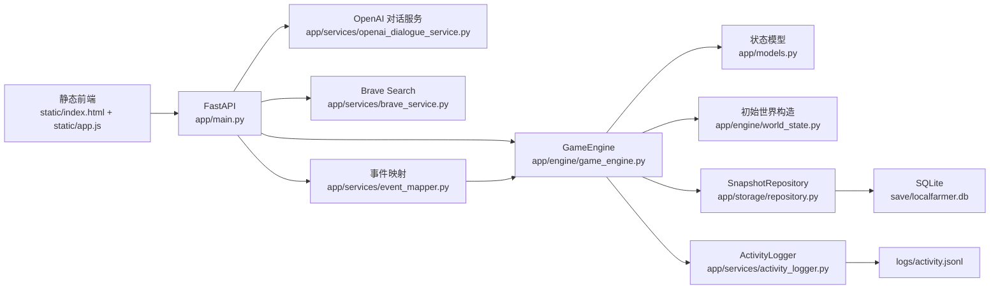

# GeoAI Pixel Lab 技术架构报告

## 1. 系统定位

`GeoAI Pixel Lab Test (UrbanComp Lab)` 是一个本地运行的多智能体社会仿真系统。它不是传统的业务 CRUD 应用，而是把下面几类机制耦合在同一个持续演化的世界中：

- 像素地图与空间移动
- 多智能体日常生活与关系演化
- 玩家输入对话与观察模式
- 外部新闻与宏观调控注入
- 股票市场、借贷、信用与口碑
- 任务推进与故事线积累

这个系统的关键点是：前端不是在展示静态数据表，而是在观察一个会自己继续运转的世界。

## 2. 总体架构

整体仍然是单体架构，但内部已经形成几个清晰子域：

- 世界仿真
- 社交与记忆
- 金融系统
- 事件系统
- 前端观察与控制

## 3. 分层结构

### 3.1 接入层

[app/main.py](/Volumes/Yaoy/project/LocalFarmer/app/main.py)

职责：

- 初始化 `GameEngine`
- 装配 Brave、OpenAI、快照仓储、日志器
- 暴露 API 并保存状态

当前关键接口：

- `GET /api/state`
- `POST /api/move`
- `POST /api/speak/{agent_id}`
- `POST /api/auto-speak/{agent_id}`
- `POST /api/advance`
- `POST /api/simulate`
- `POST /api/news`
- `POST /api/macro-news`
- `POST /api/player/trade`
- `POST /api/player/auto-trade`

### 3.2 领域模型

[app/models.py](/Volumes/Yaoy/project/LocalFarmer/app/models.py)

核心模型：

- `WorldState`
- `Agent`
- `Player`
- `Task`
- `LabEvent`
- `DialogueOutcome`
- `MarketState`
- `LoanRecord`
- `SocialThread`
- `StoryBeat`

当前世界状态版本已经提升到 `17`，旧快照如果没有市场阶段、板块轮动等字段会被丢弃。

### 3.3 世界引擎

[app/engine/game_engine.py](/Volumes/Yaoy/project/LocalFarmer/app/engine/game_engine.py)

这是系统的实际运行核心。职责包括：

- 世界推进
- 玩家/NPC 移动与碰撞
- 玩家与 NPC 对话
- NPC 环境对话
- 每日刷新
- 小屋与体力恢复
- 关系、合作、冲突、调停
- 金融市场
- 借贷结算
- 宏观消息注入
- 系统新闻生成
- 行为日志写出

### 3.4 对话层

- [app/engine/dialogue_system.py](/Volumes/Yaoy/project/LocalFarmer/app/engine/dialogue_system.py)
  - 本地 fallback
  - 对话从“性格模板”升级为“欲望驱动”

- [app/services/openai_dialogue_service.py](/Volumes/Yaoy/project/LocalFarmer/app/services/openai_dialogue_service.py)
  - 玩家主动对话时优先调用 `gpt-5-mini`
  - Prompt 中明确注入欲望、记忆流、财务压力和局部视角约束

### 3.5 外部事件层

- [app/services/brave_service.py](/Volumes/Yaoy/project/LocalFarmer/app/services/brave_service.py)
  - 搜索外部新闻

- [app/services/event_mapper.py](/Volumes/Yaoy/project/LocalFarmer/app/services/event_mapper.py)
  - 把 Brave 搜索结果映射成经济、科技、GeoAI 等事件
  - 把玩家宏观调控输入映射成带方向、强度和目标板块的市场事件

## 4. 单一世界状态设计

系统以 `WorldState` 为唯一真相源。

`WorldState` 里包含：

- 时间：`day / time_slot / weather`
- 玩家
- 所有 Agent
- 任务和归档任务
- 最近事件
- 市场状态
- 借贷记录
- 故事线
- 社交线程
- 最新对话

这个设计的优点：

- 前端逻辑简单
- 快照保存简单
- 每次请求都能完整恢复世界

代价：

- 状态包会持续变大
- 前端重绘成本随着功能增加继续上升
- 不适合高并发多人同步场景

当前阶段这个权衡是合理的。

## 5. 智能体架构

### 5.1 Agent 的结构

每个 Agent 同时具有以下几层：

1. 静态身份层
- 名字
- 角色
- persona
- 专长

2. 数值状态层
- 心情
- 压力
- 专注
- 体力
- 好奇心
- 研究技能
- GeoAI 推理技能

3. 社交结构层
- 关系值
- 盟友
- 对手
- goals
- taboos
- desired_resource

4. 叙事层
- 短期记忆
- 长期记忆
- immediate intent
- memory stream
- 当前活动
- 最近互动
- 状态摘要

5. 财务层
- 现金
- 持仓
- 金钱欲望
- 慷慨度
- 金钱压力
- 信用值
- 风险偏好

6. 生活层
- 小屋位置
- 是否休息
- 何时醒来

### 5.2 欲望驱动

现在的角色不再只靠“风格标签”说话，而是先根据当前状态推导主欲望。

典型主欲望包括：

- 恢复体力
- 缓解钱压
- 守住节奏
- 证明自己
- 获得连接
- 照顾别人
- 把事情说清
- 抓机会

这套欲望会同时作用在：

- 玩家对话回复
- NPC 环境互聊
- 联盟和冲突事件
- 市场态度

### 5.3 每日刷新

每天早晨系统会执行每日刷新：

- 调整心情、压力、专注、好奇心
- 根据天气、信用、借贷压力修正状态
- 更新泡泡、最近互动和当天记忆

这样角色具备“日级别”的连续性。

## 6. 世界推进与运行机制

### 6.1 模拟循环

`simulate_world()` 当前会按顺序执行：

1. 刷新市场时钟
2. 刷新角色计划
3. 更新市场盘中波动
4. 随机生成系统新闻
5. NPC 自主移动
6. NPC 自动交易
7. NPC 环境对话
8. 策略事件
9. 借贷结算
10. 老化社交线程
11. 老化故事线
12. 轻微修正玩家压力
13. 刷新任务
14. 刷新 memory stream
15. 写日志

### 6.2 前端运行开关

前端的“系统运行：开/暂停”本质上是自动模拟的总开关。

暂停后会冻结：

- 自动模拟 tick
- 自动漫游
- 观察模式自动对话
- 观察模式自动交易
- 自动推进时段

但仍允许：

- 手动交易
- 宏观调控
- 看盘
- 手动对话

### 6.3 观察模式

观察模式把玩家从“操作者”切成“外部观察者”：

- 玩家自动移动
- 自动发言
- 自动交易
- 自动推进时段
- 你只负责注入外部事件和宏观消息

## 7. 经济系统详解

这是当前系统里最复杂的子系统之一。

### 7.1 经济系统组成

经济系统由五层构成：

1. 股票市场
2. 板块轮动
3. 玩家/Agent 交易行为
4. 借贷与信用
5. 宏观事件与系统新闻

这些层不是并列孤立的，而是共同作用于一个统一的 `MarketState` 和所有 Agent 的现金、持仓、情绪与欲望。

### 7.2 市场基础对象

`MarketState` 当前包含：

- `sentiment`
- `tick`
- `regime`
- `regime_age`
- `rotation_leader`
- `rotation_age`
- `index_value`
- `stocks`
- `index_history`
- `daily_index_history`

这意味着市场不再只是价格列表，而是有：

- 当前处于什么市场周期
- 当前哪条板块主线在领涨
- 主线已经持续多久
- 日内轨迹
- 跨天轨迹

### 7.3 三种市场阶段

系统当前有三种显式市场阶段：

#### 1. 牛市

特征：

- 盘中基础漂移偏正
- 利好消息放大更明显
- 利空消息缓冲更强
- 系统新闻更偏正面

典型表现：

- 上涨天数更多
- 回撤存在但恢复更快
- 主线板块更容易连续领涨

#### 2. 震荡市

特征：

- 上下波动接近均衡
- 情绪中性
- 资金更容易在板块之间轮动

典型表现：

- 大盘方向不强
- 轮动加快
- `AGR` 更容易成为防守和补涨主线

#### 3. 风险市

特征：

- 盘中基础漂移偏负
- 负面冲击放大
- 正面消息作用减弱
- 系统新闻更容易偏谨慎或利空

典型表现：

- `SIG` 更容易承压
- `AGR` 更容易抗跌
- 市场先从风险市修复到震荡市，再回牛市

### 7.4 市场阶段切换机制

市场阶段不是纯随机切换，而是由以下因素共同决定：

- 最近几天的指数收益
- 当前市场情绪 `sentiment`
- 当前阶段已经持续了多久
- 每天开盘时的小概率强制滚动

这使市场具有“惯性”：

- 牛市不会因为一根阴线立刻变风险市
- 风险市也不会因为一条利好马上回牛市
- 更常见的是 `牛市 -> 震荡市 -> 风险市` 或反向的渐变过程

### 7.5 板块轮动

当前有三条板块：

- `GEO`
- `AGR`
- `SIG`

系统用 `rotation_leader` 表示当前主线板块，用 `rotation_age` 表示已经持续了几天。

轮动并非只取决于市场阶段，也取决于：

- 当前主线板块自身涨幅是否过大
- 其他板块是否出现明显相对强势
- 每日开盘时的重新评估

不同市场阶段中的典型轮动偏好：

#### 牛市

- `GEO` 和 `SIG` 更容易成为主线
- `GEO` 更像中期逻辑
- `SIG` 更像高弹性方向

#### 震荡市

- `AGR` 更容易获得相对收益
- 资金更容易在三者之间切换
- 轮动速度更快

#### 风险市

- `AGR` 更容易承担防守角色
- `SIG` 更容易补跌
- `GEO` 介于两者之间

当前主线板块会得到：

- 盘中额外漂移加成
- 利好消息的优先放大
- 系统新闻更高概率点名

非主线板块会进入：

- 跟涨
- 补涨
- 补跌

这些更符合“市场不是所有板块一起涨跌”的真实结构。

### 7.6 价格更新机制

盘中价格由多项叠加：

- 阶段基础漂移
- 情绪漂移
- 天气偏置
- 板块偏置
- 当前轮动主线偏置
- 均值回归
- 极端延伸后的回撤
- 系统保护盘
- 随机冲击

因此，某只股票的一次涨跌不是单因子决定，而是多因素叠加的结果。

### 7.7 下跌保护与托底

系统并没有做“永远只涨”的假市场，但也避免了“全员资产被轻易砸穿”。

当前保护机制包括：

- 日内下跌底线
- 指数过低时的支持盘
- 个股过度下跌时的技术性反弹
- 牛市中负面冲击折损

这使大盘长期偏向好，但仍保留真实波动。

### 7.8 事件冲击机制

市场事件有两类：

#### 1. Brave / 外部新闻

- 从真实搜索结果映射
- 通过关键词识别正负面倾向
- 自动判断目标板块
- 自动给出事件强度

#### 2. 玩家宏观调控

玩家可以显式指定：

- 方向：利好 / 利空 / 震荡
- 强度：1-5
- 目标：全市场 / GEO / AGR / SIG

最终事件进入 `GameEngine._apply_event_to_market()` 时，会再结合：

- 当前市场阶段
- 当前主线板块

决定实际价格变动幅度。

### 7.9 系统新闻

系统自己会随机生成经济新闻：

- 来源显示为“系统新闻台”
- 偏向当前市场阶段和轮动主线
- 会进入事件流
- 会影响股价、角色情绪、记忆与讨论内容

这让世界不会完全依赖玩家外部输入，也能形成持续的市场叙事。

### 7.10 玩家与智能体交易

#### 玩家交易

玩家支持：

- 买入
- 卖出
- 一键全卖
- 观察模式自动交易

#### 智能体交易

智能体交易受这些因素影响：

- 金钱压力
- 风险偏好
- 当前市场情绪
- 当前主线板块
- 持仓盈亏
- 当前阶段是牛市、震荡市还是风险市

因此，Agent 不再只是“随机买一手”，而是在不同市场条件下表现不同：

- 风险市更偏保守
- 牛市更敢追主线
- 资金紧张时更容易减仓

### 7.11 借贷与信用

借贷规则：

- 只有明确说出借款/给钱/报销等动作才会成交
- 默认次日还款
- 利息由借款方提出

信用系统当前会影响：

- 借贷是否通过
- 愿不愿意继续合作
- 愿不愿意提供信息支持
- 角色之间的社会口碑

所以信用已经不只是财务风控字段，而是社会交互变量。

## 8. 任务与叙事

### 8.1 任务系统

当前主任务已经转成团队现金增长逻辑，科研只占较轻的支线位置。

任务支持：

- 实时刷新
- 达成即归档
- 前端显示归档任务

### 8.2 叙事对象

系统当前叙事结构由四类对象组成：

- `events`
- `ambient_dialogues`
- `social_threads`
- `story_beats`

其中：

- `events` 记录公开世界事件
- `ambient_dialogues` 记录最近听到的互聊
- `social_threads` 表示一条关系线在连续发展
- `story_beats` 表示合作、冲突、调停等更强事件节点

## 9. 数据持久化与日志

### 9.1 快照

[app/storage/repository.py](/Volumes/Yaoy/project/LocalFarmer/app/storage/repository.py)

使用 SQLite 存整包 `WorldState`。

适合：

- 单机原型
- 快速恢复
- 简单调试

不适合：

- 高并发多人
- 事件溯源级重放

### 9.2 行为日志

[app/services/activity_logger.py](/Volumes/Yaoy/project/LocalFarmer/app/services/activity_logger.py)

日志写入 [logs/activity.jsonl](/Volumes/Yaoy/project/LocalFarmer/logs/activity.jsonl)，包含：

- 玩家移动
- NPC 自主移动
- 玩家对话
- NPC 环境对话
- 系统新闻与宏观调控注入
- 市场交易
- 借贷
- 每日刷新
- 世界模拟 tick

日志可以作为后续行为回放和研究分析的基础。

## 10. 前端架构

前端仍然是原生 HTML/CSS/JS，但已经承担较重职责。

当前主要负责：

- 地图 Canvas 渲染
- 角色动画插值
- 面板刷新
- 时K / 日K 绘图
- 相机控制
- 观察模式
- 自动模拟定时器
- 系统运行开关

优点：

- 部署简单
- 改动直接

风险：

- [static/app.js](/Volumes/Yaoy/project/LocalFarmer/static/app.js) 持续变大
- 后续更适合拆成 `renderer / panels / market / controls / api`

## 11. 配置与安全策略

- 真实密钥不进仓库
- 默认从 `/tmp/localfarmer.env` 读取
- `.env.example` 只保留空占位
- 当前默认模型为 `gpt-5-mini`

这是本地开发友好的方案，但不是生产级 secrets 管理。

## 12. 当前优势

- 世界状态集中，调试成本低
- 多个子系统已形成闭环
- 既支持玩家直接参与，也支持纯观察模式
- 市场不再是简单随机数，而是有阶段和轮动结构
- 角色社交与金融系统已经互相影响

## 13. 当前限制

### 13.1 `GameEngine` 过重

它已经同时承担：

- 社交
- 市场
- 借贷
- 休息作息
- 世界推进
- 事件调度

后续最好拆出：

- market subsystem
- social subsystem
- daily-life subsystem
- orchestration subsystem

### 13.2 前端单文件过大

[static/app.js](/Volumes/Yaoy/project/LocalFarmer/static/app.js) 已经承担过多职责，维护成本会持续增加。

### 13.3 完整状态全量返回

虽然简单，但未来会造成：

- 状态包持续膨胀
- 不必要重绘
- 增量同步困难

## 14. 下一步建议

最值得继续做的方向：

1. 把经济系统继续拆成独立子模块
2. 给宏观调控加政策模板，如降息、补贴、监管收紧、财政刺激
3. 给市场加成交记录、委托单和止盈止损
4. 给板块轮动加更长周期的“主线衰减与新主线接棒”
5. 把行为日志做成回放和图表分析

## 15. 结论

当前版本已经不是“会聊天的像素实验室”，而是一个带经济系统、市场阶段、板块轮动、借贷与社会关系耦合的多智能体世界。

系统最核心的价值是它已经形成了真正的闭环：

- 世界自己运行
- 角色自己改变
- 市场自己波动
- 玩家可以直接参与，也可以站在更高层做宏观干预
