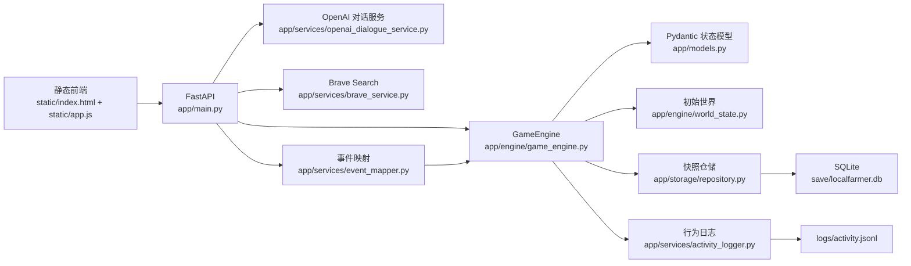

# GeoAI Pixel Lab 技术架构报告

## 1. 概述

`GeoAI Pixel Lab Test (UrbanComp Lab)` 是一个本地运行的单体式多智能体仿真系统。它把“像素地图 + 多角色社会互动 + 外部信息注入 + 金融行为”放进同一个持续演化的世界状态里。

当前实现重点不是做单一任务型应用，而是做一个可观察、可干预、会自己继续演化的社会实验场：

- 玩家可以直接走动、对话、交易
- 也可以切到观察模式，只负责外部注入和宏观调控
- NPC 会记忆、休息、合作、冲突、借贷、交易、积累口碑
- 市场会被盘中波动、外部新闻和玩家手动发布的宏观消息共同影响

## 2. 总体架构

系统采用“静态前端 + FastAPI + 单世界状态引擎 + SQLite 快照 + JSONL 日志 + 外部 AI/搜索服务”的结构。

## 3. 后端模块

### 3.1 API 接入层

[app/main.py](/Volumes/Yaoy/project/LocalFarmer/app/main.py)

职责：

- 初始化 `GameEngine`、快照仓储、日志器、Brave、OpenAI 服务
- 提供 HTTP API
- 处理异常并做状态保存

当前关键接口：

- `GET /api/state`
- `POST /api/move`
- `POST /api/speak/{agent_id}`
- `POST /api/auto-speak/{agent_id}`
- `POST /api/advance`
- `POST /api/simulate`
- `POST /api/news`
- `POST /api/macro-news`
- `POST /api/player/trade`
- `POST /api/player/auto-trade`

### 3.2 领域模型

[app/models.py](/Volumes/Yaoy/project/LocalFarmer/app/models.py)

系统以 `WorldState` 为唯一核心快照对象。当前模型覆盖：

- 世界时间、天气、地图尺寸
- 玩家状态
- NPC 列表
- 任务与归档任务
- 事件、环境对话、故事线、社交线程
- 实验室指标
- 借贷记录
- 市场状态

市场状态已经包含两套 K 线数据：

- `index_history`：盘中实时序列，用于时K
- `daily_index_history`：跨天日线序列，用于日K

### 3.3 世界引擎

[app/engine/game_engine.py](/Volumes/Yaoy/project/LocalFarmer/app/engine/game_engine.py)

这是当前系统的调度核心，负责：

- 玩家移动与碰撞
- NPC 自主移动
- 玩家/NPC 对话提交
- 观察模式下自动互动
- 每日状态刷新
- 小屋休息、体力恢复、夜晚回屋
- 借贷、信用、口碑、合作与信息支持判断
- 股票市场、盘中波动、宏观消息冲击
- 任务推进与任务归档
- 故事线、关系事件、环境对话
- 世界日志写出

当前这是一个“大引擎”设计，优点是集中、易调试，代价是单文件职责偏重。

### 3.4 对话与事件服务

- [app/services/openai_dialogue_service.py](/Volumes/Yaoy/project/LocalFarmer/app/services/openai_dialogue_service.py)
  - 玩家主动对话时优先调用 `gpt-5-mini`
  - 输出受结构约束，避免无格式返回

- [app/engine/dialogue_system.py](/Volumes/Yaoy/project/LocalFarmer/app/engine/dialogue_system.py)
  - 本地 fallback
  - 日常聊天短句化，科研占比降低

- [app/services/event_mapper.py](/Volumes/Yaoy/project/LocalFarmer/app/services/event_mapper.py)
  - Brave 搜索结果映射为 `LabEvent`
  - 宏观调控台输入映射为带方向、强度、目标板块的市场事件

## 4. 前端架构

### 4.1 页面结构

- [static/index.html](/Volumes/Yaoy/project/LocalFarmer/static/index.html)
- [static/styles.css](/Volumes/Yaoy/project/LocalFarmer/static/styles.css)
- [static/app.js](/Volumes/Yaoy/project/LocalFarmer/static/app.js)

当前页面布局是：

- 左侧主舞台：大地图
- 右侧操作栏：对话、外部注入、宏观调控、交易
- 中部独立大盘：时K / 日K 切换
- 底部信息区：任务、指标、对话记录、角色信息、最近事件

### 4.2 前端状态

前端保留的主要是表现层状态，而不是领域真相：

- `state`：后端返回的完整世界快照
- `sceneEntities`：角色动画插值
- `cameraState`：相机缩放、拖拽、重置
- `observerMode`：观察模式
- `systemRunning`：整个自动演化系统的运行 / 暂停
- `marketViewMode`：`intraday / daily`
- `pendingDialogue`：对话等待态

### 4.3 自动化运行

前端目前通过多个定时器驱动世界：

- 自动模拟 tick
- 自动漫游
- 观察模式自动互动
- 观察模式自动交易与自动推进

“系统运行：开/暂停”按钮本质上是这些自动定时器的总开关。暂停后：

- 自动模拟冻结
- 观察模式自动行动冻结
- 自动交易冻结
- 自动推进冻结

手动看盘、手动发宏观消息、手动交易仍可继续。

## 5. 智能体系统

### 5.1 状态层

每个 NPC 当前至少包含以下状态簇：

- 基础身份：名字、角色、persona、专长
- 数值状态：心情、压力、专注、体力、好奇心、技能
- 社交结构：关系、盟友、对手、目标、禁忌
- 记忆：长期、短期、memory stream、即时意图
- 生活状态：小屋、是否休息、何时醒来
- 财务状态：现金、持仓、金钱欲望、慷慨度、信用值、风险偏好

### 5.2 行为层

智能体不是纯随机移动，而是受以下因素共同约束：

- 当前时段和天气
- 体力与是否回屋
- 当前计划与资源偏好
- 关系和口碑
- 金钱压力与持仓
- 外部事件和市场波动

### 5.3 每日刷新

系统每天早晨会自动刷新角色状态：

- 重新调整心情、压力、专注、好奇心
- 更新泡泡、最近互动和当天记忆
- 结合天气、借贷、信用压力微调角色节奏

这使角色具备“天级别”的连续演化，而不是只靠一次次独立对话推进。

## 6. 金融与市场系统

### 6.1 股票市场

当前市场有三支股票：

- `GEO`：GeoGrid
- `AGR`：AgriLoop
- `SIG`：SignalWorks

市场波动来源包括：

- 盘中随机噪声
- 情绪与天气偏置
- 行业偏置
- 均值回归
- 极端延伸后的回撤
- 外部新闻事件
- 玩家发布的宏观消息

系统支持：

- 正常涨跌
- 明显回撤
- 涨停 / 跌停
- 盘中时K
- 跨天日K

### 6.2 玩家交易

玩家可通过界面：

- 查看可用资金
- 查看当前持仓
- 买入 / 卖出
- 一键全卖当前标的

观察模式下，玩家也可自动买卖。

### 6.3 借贷、信用与口碑

借贷规则：

- 必须在明确对话中说清借款意图
- 默认次日归还
- 利息由借款人提出

信用系统：

- 逾期掉信用
- 按时还款回升信用
- 低信用会降低借贷成功率
- 低信用还会压低合作机会与信息支持

因此，信用值已经不是单纯财务参数，而是实验室社会结构的一部分。

### 6.4 宏观调控台

玩家可通过前端手动发布一条宏观消息，并显式指定：

- 标题
- 摘要
- 类别
- 方向：利好 / 利空 / 震荡
- 强度：1-5
- 目标：全市场 / GEO / AGR / SIG

这条消息会被映射为带 `tone_hint / market_strength / market_target` 的 `LabEvent`，直接进入市场引擎。

## 7. 任务与叙事系统

### 7.1 任务

当前主任务已转为团队资金增长逻辑，不再只是科研推进。

系统支持：

- 活动任务
- 自动进度更新
- 达成后自动归档
- 归档任务显示在前端任务面板

### 7.2 叙事结构

叙事不是线性剧情，而是运行时积累出来的：

- `events`：最近世界事件
- `ambient_dialogues`：环境对话
- `social_threads`：连续社交线程
- `story_beats`：合作 / 对抗 / 调停等故事节点

## 8. 数据持久化与日志

### 8.1 快照

[app/storage/repository.py](/Volumes/Yaoy/project/LocalFarmer/app/storage/repository.py) 使用 SQLite 存整包 `WorldState`。

特点：

- 简单
- 恢复快
- 适合原型

当前版本号已经升到 `15`，旧存档会因字段不兼容被丢弃。

### 8.2 日志

[app/services/activity_logger.py](/Volumes/Yaoy/project/LocalFarmer/app/services/activity_logger.py)

行为日志写入 [logs/activity.jsonl](/Volumes/Yaoy/project/LocalFarmer/logs/activity.jsonl)，包含：

- 位置快照
- 玩家/NPC 对话
- 环境对话
- 外部新闻和宏观调控注入
- 自动交易和市场事件
- 每日刷新
- 世界模拟 tick

## 9. 配置与安全策略

- 真实密钥不进仓库
- 配置默认从 `/tmp/localfarmer.env` 读取
- `.env.example` 只保留空占位
- 默认 OpenAI 模型为 `gpt-5-mini`

这种策略适合本地开发，但如果进入多人部署，应改成更规范的 secrets 管理。

## 10. 当前架构优点

- 单一世界状态，前后端同步简单
- 原型迭代速度快
- 外部 AI、外部搜索和内部规则引擎已形成闭环
- 同时支持手动参与和纯观察模式
- 金融、社交、日常生活机制已经耦合在同一个世界里

## 11. 当前主要约束

### 11.1 `GameEngine` 偏重

它已经同时承担：

- 社交
- 金融
- 任务
- 体力与作息
- 世界推进
- 日志

后续继续加功能时，建议拆分成子系统。

### 11.2 前端仍是单文件

[static/app.js](/Volumes/Yaoy/project/LocalFarmer/static/app.js) 已经同时负责：

- 渲染
- 面板
- 输入
- 自动模式
- API 请求
- 市场图表

中长期建议拆成 `renderer / controls / panels / market / api client`。

### 11.3 接口仍返回完整世界

优点是简单，缺点是状态会越来越大。当前适合单机原型，不适合多人高频同步。

## 12. 下一步建议

优先级较高的演进方向：

1. 把 `GameEngine` 拆成社会、市场、作息、任务四个子系统
2. 给宏观调控台增加预设政策按钮，如降息、监管收紧、补贴、外部危机
3. 给市场加入玩家委托单、止盈止损和成交记录
4. 给任务系统增加按天结算和历史归档页
5. 给日志系统增加回放和关系图可视化

## 13. 结论

当前版本已经不是“会聊天的像素实验室”，而是一个以 `WorldState` 为中心的本地多智能体社会金融仿真系统。

它的核心闭环已经形成：

- 世界持续运行
- 角色会记忆、休息、合作、借贷、交易和改变关系
- 玩家既能进入世界参与，也能站在外部进行宏观调控
- 市场和社会结构会被这些行为共同改写
