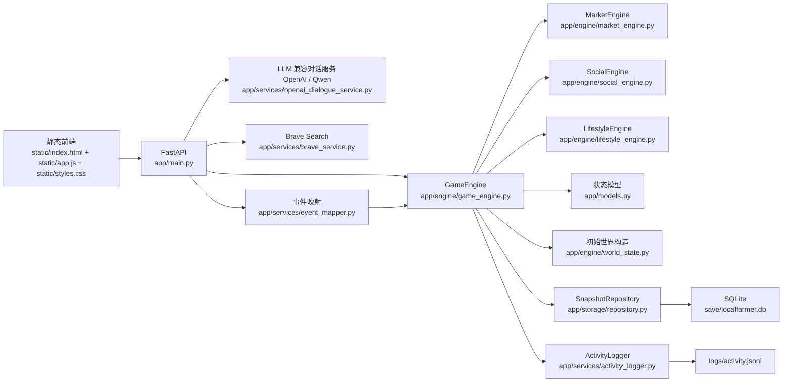

# GeoAI Pixel Lab 技术架构报告

- 开发方：`UrbanComp Lab` ([urbancomp.net](https://urbancomp.net))
- 仓库地址：[github.com/whuyao/PixelLab](https://github.com/whuyao/PixelLab)

## 1. 系统定位

`GeoAI Pixel Lab Test (UrbanComp Lab)` 是一个本地运行的多智能体社会仿真系统。它把以下几类机制耦合在同一个持续演化的世界里：

- 像素地图与空间移动
- 多智能体日常生活、欲望、关系和记忆
- 玩家输入对话与观察模式
- 外部新闻时间线、系统新闻与随机事件
- 股票市场、借贷、信用、实验室口碑、地下赌场与地下案件
- 政府财政、监管、保障、公共服务与政府资产
- 游客、旅馆、集市与旅游消费
- 任务推进、GeoAI 研究与每日晨报

系统的核心价值不在单次问答，而在“一个会自己运转、自己积累后果的世界”。

## 2. 总体架构

整体仍然是单体应用，但内部已经形成几个相对清晰的子域：

- 世界仿真域
- 社交与记忆域
- 市场与金融域
- 生活消费与地产域
- 财政与公共服务域
- 旅游与外来需求域
- 地下案件域
- 外部事件域
- 前端观察与控制域

## 3. 分层结构

### 3.1 接入层

[app/main.py](../app/main.py)

职责：

- 初始化 `GameEngine`
- 装配 LLM 提供方、Brave、快照仓储和日志器
- 暴露 API 并保存状态

当前关键接口：

- `GET /api/state`
- `POST /api/state/diff`
- `POST /api/move`
- `POST /api/speak/{agent_id}`
- `POST /api/auto-speak/{agent_id}`
- `POST /api/advance`
- `POST /api/simulate`
- `POST /api/news`
- `POST /api/news/timeline`
- `POST /api/macro-news`
- `POST /api/player/trade`
- `POST /api/player/auto-trade`
- `POST /api/bank/borrow`
- `POST /api/bank/deposit`
- `POST /api/bank/withdraw`
- `POST /api/bank/repay/{loan_id}`
- `POST /api/government/policy`
- `POST /api/lifestyle/consume`
- `POST /api/properties/{property_id}/buy`
- `POST /api/properties/{property_id}/sell`
- `POST /api/gray-cases/{case_id}/action`

### 3.2 领域模型层

[app/models.py](../app/models.py)

核心模型包括：

- `WorldState`
- `Agent`
- `Player`
- `Task`
- `LabEvent`
- `DialogueOutcome`
- `DialogueRecord`
- `DailyBriefing`
- `MarketState`
- `IndexCandle`
- `LoanRecord`
- `BankState`
- `BankLoanRecord`
- `ConsumableItem`
- `PropertyAsset`
- `FinanceRecord`
- `GrayCase`
- `SocialThread`
- `StoryBeat`
- `TouristAgent`
- `TourismState`
- `GovernmentState`
- `CompanyState`
- `NewsTimelineItem`
- `CasinoState`

当前世界状态版本为 `60`。旧快照会在加载时补齐新字段；如果版本过旧，则丢弃并回到新的初始世界。

### 3.3 世界引擎

[app/engine/game_engine.py](../app/engine/game_engine.py)

`GameEngine` 是系统实际运行的核心，负责：

- 世界推进与时段切换
- 玩家 / NPC 移动与碰撞
- 玩家与 NPC 对话
- NPC 环境互聊
- 欲望与计划刷新
- 每日刷新与回屋休息
- 市场波动、交易、借贷和存款
- 税收、保障、监管与公共投资
- 游客流量、旅馆、集市与外来消息
- 宏观消息、系统新闻和随机实验室事件
- 地下案件升级、曝光与玩家处置
- 任务更新、研究里程碑、晨报生成
- 快照和日志写出

当前 `GameEngine` 已不再独占所有业务逻辑，而是主要承担编排职责，并把两块高频子域拆给：

- [app/engine/market_engine.py](../app/engine/market_engine.py)
  - 市场视图准备
  - 盘中 tick
  - 玩家交易与自动交易
  - 市场事件冲击

- [app/engine/social_engine.py](../app/engine/social_engine.py)
  - 玩家对话
  - NPC 互聊
  - 社交视图准备
  - 晨报与记忆同步

- [app/engine/lifestyle_engine.py](../app/engine/lifestyle_engine.py)
  - 生活与地产视图准备
  - 日常消费 tick
  - 新一天的住房与满意度结算
  - 玩家消费、买房、卖房和融资买房入口

### 3.4 对话层

- [app/engine/dialogue_system.py](../app/engine/dialogue_system.py)
  - 本地 fallback
  - 欲望驱动式短对话

- [app/services/openai_dialogue_service.py](../app/services/openai_dialogue_service.py)
  - 通过 OpenAI-compatible 协议接 OpenAI 或 Qwen
  - OpenAI 默认模型是 `gpt-5-mini`
  - Qwen 默认示例模型是 `qwen3.5-flash`
  - 观察模式下自动发言也优先走同一条链路
  - Prompt 注入角色记忆、主欲望、局部视角、财务压力和关系语境
  - 对话 / 微博原发帖 / 微博回复 / 政府原发帖 / 政府回复使用分开的模板
  - Qwen 与 GPT 使用分开的收敛策略，优先减少无意义的长推理和分析腔
  - 会把内部地图代号映射成中文地名，例如 `data_wall -> 果园坡地`
  - 模型输出后还会做一层中文清洗，移除不自然黑话和重复口头禅

### 3.5 外部事件层

- [app/services/brave_service.py](../app/services/brave_service.py)
  - 搜索外部新闻
  - 如果未配置 Brave，则由系统新闻 fallback 补足时间线

- [app/services/event_mapper.py](../app/services/event_mapper.py)
  - 把 Brave 结果映射成市场事件
  - 把外部新闻映射成方向、强度、板块明确的事件

## 4. 单一世界状态设计

系统以 `WorldState` 作为唯一真相源。

`WorldState` 主要包含：

- 时间：`day / time_slot / weather`
- 玩家与所有 Agent
- 活动任务与归档任务
- 最近事件
- 市场状态
- 借贷记录
- GeoAI 研究累计值与里程碑
- 社交线程与故事线
- 最近对话与 `dialogue_history`
- `finance_history`
- `daily_briefings`
- `news_timeline`
- `event_history`
- `gray_cases`
- `tourists / tourism`
- `government`
- `company`
- `analysis_history`
- `section_signatures`

优点：

- 前端读取简单
- 快照恢复直接
- 调试时可完整查看系统状态
- 通过 section 签名可以做按模块增量同步

代价：

- 状态包会持续变大
- 全量重绘成本高
- 不适合高并发多人协作

当前阶段，这个权衡仍然合理。

## 4.1 配套分析文档

除了结构设计文档，当前项目还维护了几份基于真实运行日志的分析报告：

- [undergrad_system_explainer.md](undergrad_system_explainer.md)
  面向本科生的系统解释，重点讲智能体、GeoAI、经济约束和涌现。
- [emergent_behavior_casebook.md](emergent_behavior_casebook.md)
  从日志里抽出的典型涌现案例。
- [recent_100day_emergence_report.md](recent_100day_emergence_report.md)
  基于最近 100 天模拟时间的系统阶段演化与角色分化分析。
- [system_development_retrospective.md](system_development_retrospective.md)
  从原型到当前复合系统的整体发展复盘。
- [big_government_mode_guide.md](big_government_mode_guide.md)
  面向演示与教学的大政府模式独立说明，聚焦权限、工期、锚点与制度影响。
- [casino_system_guide.md](casino_system_guide.md)
  面向演示与教学的地下赌场系统说明，聚焦赌局、赌税、微博扩散、灰案与监管。
- [llm_prompt_tuning_retrospective.md](llm_prompt_tuning_retrospective.md)
  复盘这一轮 OpenAI / Qwen 双模型 prompt 收敛、角色口吻分流、内部代号清洗与长期挂念整理。
- [casino_emergence_report.md](casino_emergence_report.md)
  复盘赌场上线后，在经济、微博、灰案与监管层面出现的涌现现象。
- [market_casino_social_emergence_report.md](market_casino_social_emergence_report.md)
  复盘最近 100 天里市场、赌场、微博、游客与政府形成的耦合结构，以及近期平衡性调优如何改变系统行为。
- [simulation_day312_academic_analysis.md](simulation_day312_academic_analysis.md)
  更偏学术分析写法的长期运行报告。

## 5. 智能体架构

### 5.1 Agent 结构

每个 Agent 同时具有以下层次：

1. 身份层
- 中文名
- 角色
- 专长
- 人设

2. 数值状态层
- 心情
- 压力
- 专注
- 体力
- 好奇心
- GeoAI 推理值
- 知识储备

3. 社交层
- 关系值
- 盟友
- 对手
- 口碑感知
- 当前合作或冲突姿态

4. 记忆叙事层
- 短期记忆
- 长期记忆
- `memory_stream`
- 即时意图
- 当前活动
- 最近互动
- 状态摘要

5. 财务层
- 现金
- 持仓
- 风险偏好
- 金钱欲望
- 慷慨度
- 信用值
- 金钱压力

6. 生活层
- 小屋位置
- 是否休息
- 何时醒来

7. 生活消费与地产层
- 生活满意度
- 消费意愿
- 住房品质
- 物质偏好
- 舒适偏好
- 每日生活负担
- 已持有房产

### 5.2 中文名迁移

系统当前默认 5 个角色全部使用中文名：

- 林澈
- 米遥
- 周铖
- 芮宁
- 凯川

兼容层会把旧快照里的英文名、旧小屋名、旧事件文本和部分历史对话自动本地化，确保状态迁移后仍然连续。

### 5.3 欲望驱动

角色不再仅仅依赖“风格标签”说话，而是先根据状态推导当前主欲望。

典型主欲望包括：

- 恢复体力
- 缓解钱压
- 抓住市场机会
- 守住边界
- 被接住
- 证明自己
- 把话讲清
- 照顾别人

这套欲望同时影响：

- 玩家对话回复
- NPC 互聊
- 联盟与冲突
- 借贷与交易倾向
- 地下行为触发概率

## 6. 世界推进机制

### 6.1 模拟循环

`simulate_world()` 的主要流程可以概括为：

1. 刷新市场时钟
2. 刷新角色计划与即时意图
3. 更新盘中市场波动
4. 生成系统新闻
5. 生成随机实验室事件
6. 触发监管抽查和财政相关规则
7. NPC 自主移动
8. 公司打工、银行活动和游客活动
9. 灰市活动、生活消费与地产结算
10. NPC 环境对话
11. 合作 / 冲突 / 调停事件
12. 借贷、存款利息与到期结算
13. 老化社交线程、游客停留和地下案件
14. 刷新任务、里程碑和晨报
15. 写入日志、快照和 section 签名

### 6.2 观察模式

观察模式下，玩家从“直接操作者”切换为“外部观察者”：

- 自动移动
- 自动发言
- 自动交易
- 自动推进时段
- 你主要负责观察系统、和角色对话，并在必要时调整财政或交易行为

### 6.3 系统运行开关

前端的“系统运行：开 / 暂停”本质上是自动模拟的总开关。

暂停后会冻结：

- 自动模拟 tick
- 观察模式自动行动
- 自动交易
- 自动推进

但仍保留：

- 手动对话
- 手动交易
- 看盘与查看历史

## 7. 前端架构与功能模块

### 7.1 页面结构

前端已经从“一个页面堆所有模块”重构成单壳多视图结构。当前通过 `hash route + 条件渲染` 管理 7 个子页面：

- `/#/home`
- `/#/market`
- `/#/life`
- `/#/government`
- `/#/feed`
- `/#/journal`
- `/#/teaching`

这样做的目的不是做多站点，而是：

- 保留一套状态和一套地图画布
- 避免单页过载
- 降低用户在首页的认知压力
- 让详细模块进入更像独立工作台的视图

当前 7 个视图分别承载：

- `首页`
  - 地图主舞台
  - 驾驶舱
  - 实验室主面板摘要
  - 玩家对话
  - 任务进展
  - 首页重点动态

- `市场`
  - 大盘 K 线
  - 二级页签：盘面总览 / 交易与银行 / 资金流与游客
  - 玩家交易、银行借贷、银行监控台
  - 游客与消费流
  - 政府资产与收益

- `生活与地产`
  - 生活满意度
  - 消费目录
  - 地产资产
  - 房产买卖与贷款买房

- `财政与政府`
  - 左侧：税务与财政总览
  - 右侧：税率与保障调节、政府事件摘要、政策与页面说明
  - 支持 `大政府模式` 总开关
  - 支持细权限开关：`调税 / 调息 / 建设拆除 / 收购出售 / 价格干预`

- `小镇微博`
  - 公开发帖
  - 回复 / 引用 / 点赞 / 转发 / 围观
  - `总览 / 热榜 / 传播` 三页签
  - 最近 `1000` 条公开时间线
  - 热帖传播链、围观人数和高热作者
  - 自动发帖与自动回帖支持 LLM 精修
  - 支持 `只看游客投资 / 只看政府回应 / 只看赌场传闻`
  - 支持按情绪筛选
  - 支持 `阅读锁定`

- `日志与观察`
  - 实时分析
  - 实时对话
  - 经济事件流

- `晨报与案件`
  - Lab Daily
  - 最近事件
  - 地下案件处置台
  - 主线新闻时间线
  - Lab Daily
  - 最近事件
  - 主线新闻时间线

- `智能体教学`
  - 面向本科生 / 研究生的系统解释页
  - 解释智能体、GeoAI、行为涌现和经济底层逻辑
  - 给出简化数学模型和学习路径

### 7.1.1 小镇微博作为公开舆论层

`小镇微博` 是当前系统新增的一层半公开信号市场。它位于：

- 私下对话与短期记忆之上
- `Lab Daily`、政策说明和正式事件之下

它的作用不是提供另一个聊天框，而是把个体体验公开化，并让公开信号反过来改变系统状态。

当前稳定版里，这一层又增加了三类直接面向观察者的控制：

- 主题筛选：游客投资 / 政府回应 / 赌场传闻
- 情绪筛选：中性 / 温和 / 兴奋 / 紧张 / 冷静
- 阅读锁定：冻结当前微博时间线和热榜，避免自动刷新打断阅读

当前已实现的数据对象包括：

- `feed_timeline`
- `FeedPost.reply_to_post_id`
- `FeedPost.quote_post_id`
- `FeedPost.heat`
- `FeedPost.views`
- `FeedPost.likes`
- `FeedPost.reposts`
- `FeedPost.watchers`
- `FeedPost.credibility`
- `FeedPost.impacts`
- `FeedPost.llm_refined`

微博内容生成当前采用“两段式”：

1. 世界引擎先根据作者身份、当前欲望、近期事件和目标帖子生成结构化草稿
2. `OpenAIDialogueService.build_feed_post()` 再按当前 provider 对草稿做中文精修

这样做的原因是：

- 先保住系统规则和角色逻辑
- 再利用 LLM 修正中文自然度
- 避免整条微博链完全交给模型，导致系统因随机文风而失控

当前微博和私聊对话使用的是两套不同的提示词：

- 私聊对话：更强调当下情境、关系与接话自然度
- 公开微博：更强调公开表达、情绪可见性、传播性和角色公开人格

当前主要影响链路在后端表现为：

- `market` 类帖子推动市场情绪和交易偏置
- `tourism` 类帖子推动游客信号、回头客和消费预期
- `policy` 类帖子进入政府已知信号
- `research` 类帖子推动研究叙事和 GeoAI 主线可见性
- `mood / gossip` 类帖子改变团队氛围和关系张力

同时，热帖传播还会继续向三类状态回流：

- 地图局部编队：围观、驻足、政府回应、集市讨论
- 角色记忆：高热帖子进入短期记忆与 `Lab Daily`
- 制度侧判断：政策帖与监管帖进入政府已知信号，后续影响建设和监管节奏

因此它不是 UI 层附属件，而是一个连接社会系统、开放系统、制度系统和市场系统的传播中介。

地图主舞台本身也已经升级为独立子系统：

- 分层纹理地表、沙滩、水面、树林和树冠遮挡
- 核心 5 个智能体的独立专属像素人物
- 游客外观分层
- 事件反应层：研究讨论、围观、夜市营业、看房、工坊忙碌

角色详情也已经从底部信息区迁移成透明浮窗，点击玩家、智能体或游客时弹出，不再永久占据页面空间。实时分析中的人物剖面则保留“概览型信息”，显示状态热力、总资产、存款、房产数量、房产估值、股票持仓市值和银行待还。

财政与政府页中的调税表单采用了前端草稿态：当用户正在输入税率、监管或保障参数时，section-diff 刷新不会覆盖正在编辑的值，只有提交成功后才与后端状态重新同步。

### 7.1.2 大政府模式

当前政府系统分成两层：

- `常规政府模式`
- `大政府模式`

二者共用同一套 `GovernmentState`，但干预频率、可用动作和制度强度不同。

#### 常规政府模式

常规模式下，政府仍然会：

- 征税
- 发放低收入与破产保障
- 做 15 天一次财政结算
- 维持公共服务与政府资产
- 进行较低频的建设、收购和监管

它更像一个温和调节器。

#### 大政府模式

大政府模式下，政府会升级成高权限后台智能体。它不再只是“收税 + 发补贴”，而是会基于：

- 财政储备
- 游客压力
- 住房压力
- 资产净收益
- 市场阶段
- 已知信号与微博舆情

来主动决定是否：

- 调税
- 调息
- 建设
- 拆除
- 收购挂牌资产
- 出售低效公共资产
- 干预房地产价格

这套能力并不是一把总开关全部放开，而是进一步拆成前端可控的 5 个细权限：

- `can_tune_taxes`
- `can_tune_rates`
- `can_manage_construction`
- `can_trade_assets`
- `can_intervene_prices`

对应前端接口：

- `POST /api/government/mode`
- `POST /api/government/capabilities`

#### 地图与不动产约束

大政府模式并不意味着“政府一念之间瞬间改造地图”。当前系统里，不动产已经接入了锚点和工期约束：

- 新建设施会先进入 `construction` 状态，再在 `project_due_day` 完工
- 拆除会进入 `demolishing` 状态，再在到期后回收
- 已建成、已落到合法锚点、且没有冲突的政府不动产会锁定位置
- 只有施工中、拆除中或冲突资产才允许重新排布

因此，政府设施在地图端应该表现为：

- 可施工
- 可拆除
- 可出售
- 但不应“建成后漂移”

这也是当前锚点系统的重要用途：把制度动作真正约束到空间规则之内。

### 7.2 市场中心

股票相关内容被集中到同一块模块中，避免此前“市场、任务、实验室指标混在一起”的混乱感。

市场中心当前包含：

- 大盘 `时K / 日K / 月K / 年K`
  - `时K`：最近 `24` 个盘中点
  - `日K`：最近 `31` 天
  - `月K`：最近 `12` 个月（按 `30` 天聚合）
  - `年K`：全部年份（按 `365` 天聚合）
- 宏观观察台
- 板块轮动说明
- 个股卡片
- 玩家交易
- 银行借贷
- 游客与消费流
- 政府资产与收益
- 玩家与智能体持仓 / 资金分布

当前布局已经被整理为三组内容：

- 中央主图：K 线和盘面元信息
- 右侧操作列：盘面总览、玩家交易、银行借贷
- 左下观察列：宏观观察台、游客与消费流、政府资产与收益、信贷与杠杆观察

### 7.2.1 K 线窗口定义

当前前端市场页对 K 线的定义是固定的，而不是随数据长度漂移：

- `时K`：最近 `24` 个盘中点
- `日K`：最近 `31` 天
- `月K`：最近 `12` 个月
- `年K`：全部年度桶，按 `365` 天聚合

因此前端窗口逻辑和教学说明是一致的，不再出现“日K只显示 20 天”或“月K只显示 18 个月”这类旧行为。

### 7.3 生活与地产面板

生活消费和房地产被单独放在左侧主列，避免继续和市场中心混在一起。

当前包含：

- 玩家生活满意度、消费意愿、住房品质摘要
- 团队平均满意度
- 可消费物品目录
- 当前可交易房产目录
- 玩家已持有房产目录

这块对应的后端数据主要来自：

- `WorldState.lifestyle_catalog`
- `WorldState.properties`
- `Player.life_satisfaction`
- `Agent.life_satisfaction`

当前交互已经从大卡片平铺改成：

- 下拉选择
- 当前项详情
- 操作按钮

这样能在不压缩信息密度的前提下，明显降低左侧面板的视觉噪音。

### 7.4 实时对话区

对话区已经从“整段文本硬铺开”改成结构化卡片。每条记录展示：

- 参与人
- 时间
- 话题
- 要点
- 欲望标签
- 借贷 / 灰色交易标签

并支持：

- 按人物筛选
- 只看借贷
- 只看灰色交易
- 只看欲望冲突
- 展开详情状态保持
- 滚动位置保持

对话筛选器现在只放在“实时对话”模块内部，而不再放在日志页全局工具栏中，避免用户误以为它会影响所有日志模块。

### 7.5 经济事件流

右侧新增了独立的“经济事件流”面板，位置在“最近事件”上方。

它和“最近事件”的区别是：

- 最近事件：偏世界层摘要，混合任务、故事线、地下案件、新闻
- 经济事件流：只记录真实资金动作

当前会写入 `finance_history` 的行为包括：

- 玩家和智能体股票买卖
- 玩家和智能体生活消费
- 玩家地产买入 / 卖出 / 日结
- 银行借贷与还款
- 人际借款与还款

前端默认展示最近 20 条，用于快速判断：

- 谁最近在消费
- 谁最近在借钱
- 谁刚买了房
- 谁最近主要在做股票交易

## 8. 经济与生活系统详解

### 8.1 经济系统组成

经济与生活系统由八层组成：

1. 股票市场
2. 市场阶段
3. 板块轮动
4. 玩家 / Agent 交易
5. 银行借贷与信用
6. 人际借贷
7. 地下案件与实验室口碑
8. 生活消费与房地产
9. 经济事件流

这些层不是彼此独立的，而是共同作用于 `MarketState`、团队现金、角色欲望和社交结构。

### 8.2 市场基础对象

`MarketState` 主要包含：

- `sentiment`
- `tick`
- `regime`
- `regime_age`
- `rotation_leader`
- `rotation_age`
- `index_value`
- `stocks`
- `index_history`
- `daily_index_history`

这意味着市场不再只是一个价格列表，而是一个带周期、板块主线和跨天轨迹的状态机。

### 8.3 三种市场阶段

#### 牛市

- 基础漂移偏正
- 利好消息放大
- 利空冲击被缓冲
- `GEO / SIG` 更容易领跑

#### 震荡市

- 上下波动接近均衡
- 主线更容易切换
- `AGR` 更容易获得相对收益

#### 风险市

- 基础漂移偏负
- 利空放大
- 正面消息折损
- `AGR` 更容易防守，`SIG` 更容易承压

市场阶段带有惯性，通常通过收益、情绪和持续时间共同决定切换，不会每轮随机跳变。

### 8.4 板块轮动

当前有三条板块：

- `GEO`
- `AGR`
- `SIG`

`rotation_leader` 表示当前主线板块，`rotation_age` 表示主线已持续天数。

主线板块会获得：

- 盘中漂移加成
- 利好放大
- 系统新闻更高概率点名

非主线板块则更容易出现：

- 跟涨
- 补涨
- 补跌

### 8.5 价格更新机制

单只股票的价格更新是多因子叠加的结果：

- 市场阶段漂移
- 情绪漂移
- 天气偏置
- 板块偏置
- 当前主线偏置
- 均值回归
- 延伸后的技术性回撤
- 托底保护
- 随机冲击

因此市场既不是纯随机数，也不会变成单边只涨。

### 8.6 事件冲击

进入市场的事件目前主要来自四条路径：

1. Brave 自动抓取的主线新闻时间线
2. 未配置 Brave 时由“系统新闻台”自动编造的 fallback 新闻
3. 游客消息、研究里程碑、地下案件曝光
4. 随机实验室事件与监管事件

每条事件都可以明确携带：

- 标题
- 摘要
- 正负方向
- 强度
- 目标板块

最终进入 `GameEngine` 后，对大盘和个股产生差异化冲击。

当前前端对主线新闻时间线还增加了两层观察机制：

- 窗口控制：`3 / 7 / 14` 天
- 主题筛选：`只看市场 / 只看政策 / 只看社会热点`

同时标题和摘要已经改成中文全球经济事件口径，而不是内部占位式描述。

### 8.7 玩家交易

玩家支持：

- 手动买入
- 手动卖出
- 一键全卖
- 自动交易
- 地下案件驱动的做空

玩家账户当前还包含：

- 可用资金
- 多头持仓
- 空头持仓 `short_positions`
- 空头均价

### 8.8 智能体交易

每个 Agent 是否交易以及买什么，受以下因素共同驱动：

- 风险偏好
- 金钱压力
- 现金余量
- 持仓盈亏
- 市场阶段
- 当前主线板块
- 外部新闻

白天大约 10% 的行为时间会用于交易，其余大部分仍然是日常生活和社交。

### 8.9 借贷、信用与实验室口碑

借贷规则：

- 必须在对话中明确说出借钱、给钱、报销、利率或归还意图
- 默认次日归还
- 利息由借款方提出

信用值的作用已经超出金融风控：

- 决定是否愿意出借
- 影响合作意愿
- 影响信息共享
- 影响对灰色行为的容忍度

实验室口碑则是更高层的社会变量，会受以下事件影响：

下行：

- 灰色交易
- 地下案件曝光
- 压消息
- 负面宏观和系统新闻

上行：

- 任务完成奖励
- 借款按时还清
- GeoAI 研究里程碑
- 地下案件平稳收尾
- 每日晨间的自然恢复

口碑又会反向影响：

- 借贷通过率
- 合作与信息支持
- 事件冲击的市场放大方式

### 8.10 银行借贷与存款系统

除了人与人之间的借贷，系统还引入了一个显式机构：`青松合作银行`。

核心对象：

- `BankState`
- `BankLoanRecord`

银行侧维护：

- 流动性 `liquidity`
- 基准日利率 `base_daily_rate_pct`
- 风险溢价 `risk_spread_pct`
- 累计放款
- 累计回款
- 历史违约次数

借款侧维护：

- 借款人类型：`player / agent`
- 本金
- 日利率
- 总利率
- 应还金额
- 起始日
- 到期日
- 天期
- 状态：`active / overdue / repaid`

#### 银行利率形成

银行当前报价不是固定常数，而是由以下因素叠加：

1. 基准日利率
2. 市场阶段调整
3. 借款天数溢价
4. 个人信用溢价
5. 实验室口碑调整
6. 银行自身流动性与违约压力形成的风险溢价

这意味着：

- 牛市和高信用时，报价更低
- 风险市、低口碑、低流动性和高违约时，报价更高

#### 银行存款

系统当前不只有“贷款”，还有显式的活期存款层：

- `Player.deposit_balance`
- `Agent.deposit_balance`
- `BankState.base_deposit_daily_rate_pct`
- `BankState.deposit_daily_rate_pct`

规则上，存款具有三个作用：

1. 把“现金”和“总资金”拆开，避免所有富裕角色都把钱裸放在手里  
2. 让银行形成资产负债两端，而不只是单向放贷  
3. 给玩家和智能体一个低风险、低收益的资金停泊地

智能体在现金宽裕时会自动存款，在现金吃紧时会自动取回；每天早晨会自动结息。净资产、保障资格和风控判断都已经把存款算入总资产口径。

#### 银行授信

系统当前不再按固定小档位给出授信，而是根据以下因素动态计算：

- 借款人信用值
- 借款人总资产
- 存款余额
- 当前未结清银行负债
- 银行自身流动性

当前实现里，高信用且资产较高的主体，授信已经可以达到 `5000`、`10000+`，而不是早期几十美元的演示级额度。

同时银行限制同一借款人并发未结清贷款数量，并会在存在逾期时直接拒绝继续放款。

前端的借款默认值也不再是静态常数，而会根据：

- 当前授信上限
- 现金压力
- 已有贷款负担

自动给出建议额度，并同步更新输入框上限。

#### 银行自动行为

智能体不只是被动展示数字，而会真实参与银行系统：

- 现金和体力都偏紧时，可能主动向银行借款
- 有逾期时，在现金允许下会尝试补还
- 自动借款金额也已经提升到更合理的千元级区间，不再只借几十美元

#### 银行监控台与日级历史

为了避免只看单点数字，前端市场中心已经加了一个“银行监控台”，并配套新增 `daily_bank_history` 日级序列。

日级银行历史当前记录：

- `loans_issued`
- `loans_repaid`
- `deposits_in`
- `deposits_out`
- `outstanding_balance`
- `total_deposits`

这些字段会在每天早晨固化上一工作日的银行活动，用于驱动：

- 存贷比小趋势
- 近 10 个工作日放贷 / 还款曲线
- 高杠杆借款人排行
- 银行整体杠杆观察

这一步的目的，是避免再从最近 200 条事件里硬反推银行走势，导致前段历史被截断。

#### 银行与其它系统的耦合

银行借贷会继续影响：

- 玩家和智能体现金
- 信用值
- 实验室口碑
- 金钱欲望和即时意图
- 对话记录
- 市场中心前端展示

提前部分还款会保持贷款为正常 `active` 状态，不会错误进入逾期分支；真正逾期时才会触发罚息和信用惩罚。

### 8.11 政府财政、税制与监管系统

系统当前内置一个显式政府对象：`园区财政与监管局`。

核心对象：

- `GovernmentState`

主要能力包括：

- 工资税
- 证券税
- 地产过户税
- 地产持有税
- 消费税
- 奢侈税
- 财政储备
- 低收入补助与破产救助
- 15 天一次财政分配
- 公共服务、旅游支持、住房支持
- 政府资产投资与收益

#### 监管抽查

监管并不是每轮硬触发，而是一个带冷却和强度调节的算法：

- 抽查会优先盯资产体量高、地产多、灰线风险高的对象
- `enforcement_level` 会同时影响抽查概率、罚缴强度和冷却期
- 低监管强度下，冷却期更长、罚缴更轻

#### 财政保障

保障和破产救助当前已经按总资产判断，而不再只看手头现金。也就是说：

\[
asset_i = cash_i + deposit_i + stockValue_i + propertyValue_i - liability_i
\]

只有总资产落在保障区间内，才会触发低收入补助或破产救助。

### 8.12 地下赌场系统

系统当前加入了一个固定灰色经济节点：`后巷地下赌场`。

核心对象：

- `CasinoState`
- `PropertyAsset(property_type="casino")`

赌场状态当前维护：

- 今日/累计到场
- 今日/累计下注
- 今日/累计返还
- 今日/累计赌税
- 今日/累计大赢次数
- 庄家池
- 当前热度
- 最近一句状态摘要

#### 玩家与自主赌博

赌场已经接通 3 类主体：

- 玩家：靠近赌场后可手动触发赌局
- 智能体：在资金紧张、资金很多或情绪高涨时低频自主赌博
- 游客：在类似条件下少量参与，并把体验带入微博与游客消息

#### 赌税

赌场每次结算后会显式抽取赌税，并写入：

- `government.revenues["gambling"]`

因此赌场不只影响私人现金，也会反馈到财政面板。

#### 情绪与关系

赌场结果当前会回流到人物状态：

- 小赢：提升心情与满意度
- 大赢：可能触发炫耀帖
- 亏损：提升压力
- 大亏：可能和附近人物发生争执，关系下降

#### 微博扩散

赌场已经和 `小镇微博` 连通：

- 赢大钱的智能体会炫耀
- 输钱后会带着情绪说话
- 游客会发“后巷赌局”类帖子

这让私人赌局变成了公开信号，再反过来影响游客风向、角色记忆、围观行为和监管视线。

#### 灰案与监管

赌场热度继续进入：

- 灰案注册
- 监管抽查分值
- 罚缴逻辑

所以赌场是一个明确的灰色经济放大器，而不是独立小游戏。

最近一轮参数调优后，赌场在系统中的角色又被重新平衡了一次：

- 降低自动下注上限，减少赌场把大量现金直接抽离小镇的趋势
- 强化赌局结果对 `mood / life_satisfaction / consumption_desire` 的反馈
- 让赌场更多通过微博炫耀、八卦、灰案和监管去影响社会结构
- 让财政大头更多回到工资税、消费税和政府资产收入，而不是罚款

#### 观测入口

赌场当前可从三个层面被直接观测：

- 市场页：赌场观察卡、最近 10 笔赌局、最大输赢榜
- 日志页：赌场热度与下注图、实时对话中的 `只看地下赌博`
- 地图：固定地标 `后巷地下赌场` 与附近人物活动

#### 财政分配

每 15 天进行一次财政周期结算，资金会拆到：

- 定向补贴
- 消费券
- 公共服务
- 政府投资
- 储备保留

这让财政不再只是“收税面板”，而是会真实影响消费、满意度、游客承载和地产收益。

### 8.12 地下案件系统

地下案件不是一次性标签，而是带生命周期的对象。

当前支持的类型包括：

- 内幕倒卖
- 假报销
- 数据窃取
- 封口费
- 模糊承诺诈骗
- 私下交换

案件从生成到结束通常经历：

1. 生成
2. 暗中发酵
3. 追债 / 报复 / 反咬一口等升级
4. 曝光或平稳收尾

玩家可以主动处置：

- 压消息
- 举报
- 和解
- 借机做空

一旦曝光，系统会：

- 生成公开新闻事件
- 拖累市场情绪
- 影响相关股票
- 拉低实验室口碑
- 写入角色长期记忆

### 8.13 游客与旅游经济系统

系统当前接入了轻量游客机制，核心对象包括：

- `TouristAgent`
- `TourismState`

特点：

- 同时在线游客上限控制在 `5`
- 游客分为 `regular / repeat / vip / buyer`
- 游客会入住 `湖畔旅馆`，并在 `林间集市`、湖边、果园坡地、石径工坊等区域停留
- 游客会消费、聊天、带来外部消息，甚至转化成潜在购房者
- 游客具备轻量短期记忆，会记住最近的入住、对话、消费和消息输入

#### 游客调度

这层为了控制系统压力和地图扎堆，已经引入：

- 目标位置记忆
- 区域拥挤惩罚
- 停留时长
- 启动时聚集打散

也就是说，游客不是每一轮都重新随机挑一个点，而是会在空间上形成更平滑、更分散的移动轨迹。

#### 游客与市场

游客会通过三条路径影响系统：

1. 直接消费，形成旅游收入和税收  
2. 带来外部消息，作用于市场和智能体记忆  
3. 提高本地地产与公共服务的经济价值

#### 游客收入归属

游客消费现在不是一个模糊总数，而是显式拆成三类：

1. `私人收入`
- 当游客消费落到玩家或智能体持有的旅馆、店铺、农田、温室等资产上时，经营收入直接进入该私人主体。

2. `财政资产收入`
- 当消费落到政府持有资产上时，收入直接进入 `government.reserve_balance`，并单独计入 `government.revenues["government_asset"]`。

3. `公共运营收入`
- 当消费没有落到私人或政府资产，而是由默认园区文旅运营承接时，收入进入财政储备，但单独记为 `government.revenues["tourism_public"]`，与政府资产经营收入分开。

此外，消费税会独立从游客侧额外征收并进入财政储备，因此：

\[
tourist\ payment = operating\ income + consumption\ tax
\]

其中 `operating income` 和 `tax` 在账上是分开的，不会混成一笔。

### 8.14 系统新闻与随机实验室事件

系统每天并不完全依赖玩家输入。

两类自动扰动已经接入：

#### 系统新闻

- 来源：`系统新闻台`
- 偏向经济、政策和板块逻辑
- 直接进入市场事件流

#### 随机实验室事件

- 来源：`系统奇遇`
- 更偏运营、校园、设备、合作和误传
- 直接作用于：
  - 团队现金
  - 实验室口碑
  - 团队氛围
  - 研究推进
  - 板块和个股

这使市场和实验室资金不再只由交易决定，而是会受到经营层面的随机扰动。

### 8.15 生活消费、房地产与劳动

这层是新增的轻量生活金融系统，目标不是单独做一个经营游戏，而是把“花钱换舒适度、住房和关系”接进现有世界。

核心对象：

- `ConsumableItem`
- `PropertyAsset`
- `Player.life_satisfaction`
- `Agent.life_satisfaction`

当前规则：

- 消费会减少现金，但提高生活满意度
- 礼物类消费会额外推动关系
- 房产会带来住房品质、维护费、租金或经营收入
- 买房现金不足时，允许直接走银行融资
- 每天早晨会统一结算房产收益和生活状态
- 每天会扣日常开销，且日开销会随着通胀与经济总体面上行
- 现金压力过低时，角色会更倾向去 `青松数据服务` 打工
- 政府也可以持有公共资产，并在地图上作为独立资产显示

这层会继续反馈到：

- 对话欲望
- 当日计划
- 银行借贷需求
- 日常情绪与压力
- 前端“生活与地产”面板

### 8.16 经济事件流

为了把“谁刚刚做了什么资金动作”从杂乱的世界事件里拆出来，系统新增了 `FinanceRecord` 和 `WorldState.finance_history`。

单条 `FinanceRecord` 主要包含：

- `day`
- `time_slot`
- `actor_id / actor_name`
- `category`
- `action`
- `summary`
- `amount`
- `asset_name`
- `counterparty`
- `interest_rate`
- `financed`

这层的设计目标是：

1. 让所有经济动作都能追踪
2. 让前端可以统一展示，不必再到对话记录、最近事件、人物卡里分别拼接
3. 为后续统计、图表和过滤器预留结构化基础

当前写入路径：

- 股票交易：`market`
- 日常消费：`consume`
- 房产买卖和房产日结：`property`
- 银行借贷和还款：`bank`
- 银行存款、取款和利息：`bank`
- 人际借款和归还：`loan`
- 打工、税收、保障、游客消费和政府投资：`work / tax / welfare / tourism / government`

它和 `dialogue_history` 的关系是：

- `dialogue_history` 记录“说了什么、欲望是什么、关系怎么变化”
- `finance_history` 记录“钱是怎么动的、利率多少、对象是谁”

这两个时间线并行存在，分别服务社交观察和金融观察。

## 9. 任务、研究与晨报

### 9.1 任务系统

主任务当前已经转成团队总资金增长逻辑，科研只保留为较轻的支线。

任务支持：

- 实时刷新
- 主线任务固定起点与目标值，不再使用漂移基准
- 达成即归档
- 归档历史可显示
- 奖励正式结算到实验室指标中

当前主线任务模型为：

\[
progress = \min\left(100,\max\left(0,\frac{funds-start\_value}{goal\_value-start\_value}\times100\right)\right)
\]

其中 `start_value` 与 `goal_value` 在该轮主任务生成时锁定，后续刷新只更新当前资金 `funds`，不会把“当前值”重新写成任务起点。

### 9.2 GeoAI 研究

GeoAI / 空间智能进度不再封顶，而是持续累加。

当研究跨过里程碑时，系统会：

- 生成研究新闻
- 提升实验室口碑
- 提升 `GEO` 相关股票
- 写入角色记忆

### 9.3 Lab Daily

每天早晨系统会生成一份 `Lab Daily` 晨报，总结前一天的：

- 市场表现
- 板块主线
- 财政速递与监管速递
- 游客与消费消息
- 借贷和地下案件
- 人际风波与八卦
- 研究与故事线

晨报对象为 `DailyBriefing`，会被：

- 存入 `daily_briefings`
- 展示在前端右侧
- 同步写入所有角色的长期记忆和 `memory_stream`

## 10. 日志与持久化

### 10.1 快照

[app/storage/repository.py](../app/storage/repository.py)

使用 SQLite 保存整包 `WorldState`。

优点：

- 恢复简单
- 便于单机调试
- 快速迭代

限制：

- 不适合高并发多人场景
- 不适合事件溯源级别重放

### 10.2 行为日志

[app/services/activity_logger.py](../app/services/activity_logger.py)

日志写入 [logs/activity.jsonl](../logs/activity.jsonl)，包括：

- 玩家移动
- NPC 自主移动
- 玩家对话
- NPC 环境互聊
- 市场交易
- 借贷与还款
- 地下案件升级、曝光与处置
- 系统新闻与宏观调控
- 随机实验室事件
- 每日刷新与晨报生成
- 世界模拟 tick

这些日志既是调试材料，也能作为后续行为分析与回放的基础。

## 11. 配置与安全策略

- 真实密钥不进入仓库
- 默认从 `/tmp/localfarmer.env` 读取
- `.env.example` 只保留空占位
- 支持 `LLM_PROVIDER=openai|qwen`
- OpenAI 默认模型为 `gpt-5-mini`
- Qwen 默认示例模型为 `qwen3.5-flash`

这是本地开发友好的 secrets 策略，但不是生产环境方案。

推荐配置方式：

- 开发机：`LOCALFARMER_ENV_FILE=/tmp/localfarmer.env`
- 服务器：把 env 文件放到仓库外的私有目录
- 对外访问：应用只监听 `127.0.0.1:8765`，由独立反向代理负责 HTTPS、域名和访问控制

移动端前端策略：

- 采用静态 HTML + 原生 JS + CSS 媒体查询
- 窄屏下右侧侧栏退化为纵向信息流
- 地图提供额外的缩放按钮，避免手机 Safari 缺少滚轮时无法缩放
- 使用 `100dvh` 和 safe-area inset 兼容刘海屏与 Safari 底部工具栏

## 12. 当前优势

- 单一世界状态让调试和持久化简单直接
- 社交、市场、借贷、口碑和灰色案件已经形成闭环
- 既支持玩家直接操作，也支持纯观察玩法
- 市场不再是简单随机数，而是有阶段、轮动和事件冲击结构
- 研究、任务、晨报和市场能互相传导

## 13. 当前限制

### 13.1 `GameEngine` 过重

它已经同时承担：

- 社交
- 市场
- 借贷
- 每日作息
- 任务
- 地下案件
- 事件调度

后续最好拆出：

- `market subsystem`
- `social subsystem`
- `daily-life subsystem`
- `case subsystem`
- `orchestration subsystem`

### 13.2 前端单文件仍然过大

[static/app.js](../static/app.js) 依然承担过多职责，后续更适合拆为：

- `renderer`
- `market-panels`
- `dialogue-panels`
- `controls`
- `api`

### 13.3 增量同步已落地，但状态包仍然偏大

系统已经不再只有全量状态拉取。当前后端提供：

- `GET /api/state`
- `POST /api/state/diff`

前端会基于 `section_signatures` 只请求变化 section，并做模块级合并渲染。

但限制仍然存在：

- 单个 section 里仍可能带较大 payload
- `WorldState` 本身仍在继续膨胀
- 若某一 section 设计过大，diff 命中后仍会带来较明显重绘

## 14. 后续建议

最值得继续推进的方向：

1. 给玩家交易补平仓盈亏、委托单、止盈止损
2. 给地下案件补证据链和多回合调查
3. 把市场和社交从 `GameEngine` 进一步拆模块
4. 给 Lab Daily 增加可点击跳转到相关事件
5. 继续把 diff 从 section 级推进到 action 返回级

## 15. 结论

当前版本已经不是“会聊天的像素实验室”，而是一个带社会关系、市场周期、借贷信用、实验室经营、研究里程碑和地下案件链条的多智能体世界。

系统最核心的价值，是它已经形成了可持续演化的闭环：

- 世界自己运行
- 角色自己积累欲望和后果
- 市场自己波动并响应新闻
- 玩家既能直接参与，也能从更高层面调控世界
