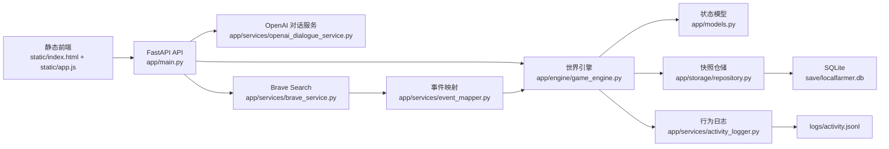

# GeoAI Pixel Lab 技术架构报告

## 1. 报告目的

本文档说明当前 `GeoAI Pixel Lab Test (UrbanComp Lab)` 系统的实际技术架构、核心模块、关键数据流、状态模型与当前实现边界。报告基于仓库当前代码实现编写，重点描述“现在系统如何工作”，而不是理想化设计。

## 2. 系统定位

本系统是一个本地运行的多智能体像素世界原型，目标不是做传统的任务驱动科研软件，而是构建一个“可观察、可注入外部信息、角色会持续互动”的田园风格社会仿真环境。

当前系统具备以下能力：

- 中文前端交互界面
- 玩家与 NPC 实时对话
- 观察模式下玩家自动移动、自动发言、自动互动
- NPC 的长期记忆、短期记忆、关系、状态和行为节奏
- 天气、时段、体力、小屋休息等生活化机制
- Brave Search 外部信息注入
- OpenAI 驱动的玩家对话回复链路
- SQLite 快照存档
- JSONL 行为日志

## 3. 总体架构

系统采用“单体后端 + 静态前端 + 外部 AI/搜索服务”的结构，整体较轻，便于本地快速迭代。

## 4. 目录与模块分层

### 4.1 接入层

- `app/main.py`
  - FastAPI 入口
  - 负责 HTTP 路由、错误转换、上下文初始化
  - 将外部请求转发给世界引擎、OpenAI、Brave 和仓储层

- `run_localfarmer.py`
  - 本地运行入口
  - 使用 Uvicorn 在 `127.0.0.1:8765` 启动服务

### 4.2 核心领域层

- `app/models.py`
  - 使用 Pydantic 定义系统的核心状态模型
  - 包括 `WorldState`、`Agent`、`Player`、`Task`、`LabEvent`、`DialogueOutcome`、`SocialThread`、`StoryBeat`

- `app/engine/game_engine.py`
  - 系统核心
  - 承担世界模拟、角色移动、关系变化、体力与回屋休息、策略事件、对话提交、日志记录等职责

- `app/engine/world_state.py`
  - 初始化世界
  - 定义初始玩家、NPC、人设、目标、关系、小屋、任务、实验室指标和初始事件

- `app/engine/dialogue_system.py`
  - 本地模板对话系统
  - 负责日常话题分类、短句风格生成、人物脾气差异、本地 fallback 对话

- `app/engine/time_system.py`
  - 管理时段推进逻辑

- `app/engine/task_system.py`
  - 管理任务推进

- `app/engine/event_system.py`
  - 构造内部事件对象

### 4.3 基础设施层

- `app/config.py`
  - 从 `/tmp/localfarmer.env` 或环境变量加载配置
  - 管理 Brave / OpenAI key、模型名、日志路径、快照路径

- `app/storage/db.py`
  - SQLite 初始化、写入快照、读取最新快照

- `app/storage/repository.py`
  - 仓储封装
  - 负责 `WorldState` 的版本校验和存取

- `app/services/activity_logger.py`
  - 将行为日志写入 `logs/activity.jsonl`

- `app/services/brave_service.py`
  - Brave Search 调用

- `app/services/event_mapper.py`
  - 将 Brave 搜索结果映射为实验室事件

- `app/services/openai_dialogue_service.py`
  - 调用 OpenAI 生成 NPC 回复
  - 使用结构化 JSON 输出约束回复格式

### 4.4 表现层

- `static/index.html`
  - 页面骨架和控件布局

- `static/app.js`
  - 前端单文件主逻辑
  - 负责地图渲染、相机控制、UI 面板更新、输入处理、轮询模拟、观察模式、自动发言、人物气泡与交互

- `static/styles.css`
  - 样式表

## 5. 核心状态模型

系统采用“单一世界状态对象”作为核心运行快照。

### 5.1 WorldState

`WorldState` 是前后端之间的主要交换对象，包含：

- 世界版本号
- 地图宽高
- 天数、时段、天气
- 玩家状态
- 全部 NPC 状态
- 任务列表
- 事件列表
- 实验室指标
- 最新对话
- 环境对话
- 社交线程
- 故事线

这种设计的优点是：

- 前端无需维护复杂局部状态
- 每次接口返回完整世界，可直接重绘
- 快照存档和恢复成本低

代价是：

- 返回体积会随着状态增大而继续增长
- 当前适合本地原型，不适合高并发多人场景

### 5.2 Agent

每个智能体包含以下几类信息：

- 静态身份
  - `id`
  - `name`
  - `role`
  - `persona`
  - `specialty`

- 行为状态
  - `current_task`
  - `current_location`
  - `position`
  - `current_activity`
  - `current_bubble`
  - `current_plan`
  - `social_stance`

- 数值状态
  - `mood`
  - `stress`
  - `focus`
  - `energy`
  - `curiosity`
  - `research_skill`
  - `geo_reasoning_skill`

- 社交结构
  - `relations`
  - `allies`
  - `rivals`
  - `goals`
  - `taboos`
  - `desired_resource`

- 记忆与叙事
  - `short_term_memory`
  - `long_term_memory`
  - `status_summary`
  - `last_interaction`

- 生活化机制
  - `home_position`
  - `home_label`
  - `is_resting`
  - `rest_until_day`

## 6. 关键运行机制

### 6.1 世界模拟

`GameEngine.simulate_world()` 每次执行会串联以下步骤：

1. 刷新智能体计划
2. 自主移动
3. 检查并触发环境对话
4. 触发合作 / 冲突 / 调停等策略事件
5. 老化社交线程
6. 老化故事线
7. 微调实验室整体状态
8. 写行为日志

这意味着系统不是简单的“随机走动 + 随机说话”，而是：

- 先决定角色当前倾向
- 再在空间中相遇
- 再把相遇升级为对话、关系变化和故事线

### 6.2 时段推进

`advance_for_reflection()` 和自动观察逻辑都会触发 `_advance_world()`。

推进时会更新：

- 天数
- 时段
- 天气
- NPC 位置
- 体力、压力、专注等状态
- 休息与起床逻辑

### 6.3 小屋与体力恢复

当前版本新增了生活化节律：

- 每个 NPC 有自己的小屋
- 夜里角色有概率回屋
- 熬夜不回去会额外掉体力
- 体力耗尽会强制回屋
- 在小屋完整待过一个时段后，体力恢复到 `100`
- 第二天早上再从小屋出来

这使得世界行为从“纯社交仿真”扩展成“带作息约束的社会模拟”。

### 6.4 对话系统

系统存在两条对话链路：

#### A. 本地模板链路

入口：

- `/api/interact/{agent_id}`
- `/api/auto-speak/{agent_id}`
- OpenAI 不可用时的 `/api/speak/{agent_id}`

特点：

- 不依赖外部模型
- 响应快
- 风格稳定
- 已做短句化和口语化处理

#### B. OpenAI 链路

入口：

- `/api/speak/{agent_id}`

特点：

- 优先调用 `gpt-5-mini`
- 通过 JSON schema 约束输出
- 要求回复短、快、口语化
- 日常聊天约占大多数，科研只在明确触发时出现

### 6.5 观察模式

观察模式是系统的重要交互设计，不要求用户亲自操控玩家。

前端开启观察模式后：

- 玩家自动移动
- 靠近 NPC 自动发言
- 自动调用 `/api/auto-speak/{agent_id}`
- 自动推进时段
- 用户主要负责观察和注入外部信息

这实际上把玩家从“手动操纵角色”切换成“观察者 / 外部干预者”。

### 6.6 外部信息注入

外部事件链路如下：

1. 前端提交话题到 `/api/news`
2. 后端调用 Brave Search
3. 取首个搜索结果
4. 通过 `event_mapper` 转换成 `LabEvent`
5. 注入世界状态
6. 更新实验室指标和 NPC 记忆

这条链路让系统能够被现实世界新闻或外部热点扰动。

## 7. 前端架构

前端是原生 HTML/CSS/JavaScript，没有引入大型框架。

### 7.1 前端职责

`static/app.js` 负责：

- 拉取完整世界状态
- 维护渲染态和少量交互态
- Canvas 地图绘制
- 角色、小屋、气泡、天气、场景效果绘制
- 键盘移动
- 鼠标点击选人
- 相机缩放、拖拽、重置
- 自动轮询模拟
- 观察模式自动行为

### 7.2 前端状态特点

前端本地维护的是“表现层状态”，而不是领域真相：

- `state`：来自后端的完整世界状态
- `sceneEntities`：用于平滑动画的前端实体
- `cameraState`：缩放和平移
- `observerMode` / `autoExplore` / `pendingDialogue` 等 UI 控制态

因此：

- 领域状态以后端为准
- 前端只做动画过渡和交互协调

这降低了前后端状态分叉的风险。

## 8. 存储与日志

### 8.1 快照存储

系统通过 SQLite 的 `snapshots` 表保存完整 `WorldState` JSON。

特点：

- 保存简单
- 恢复简单
- 适合原型期

当前不是事件溯源设计，而是“整包快照存档”。

### 8.2 行为日志

行为日志写入 `logs/activity.jsonl`，每行一个 JSON 对象。

已记录的内容包括：

- 玩家移动
- NPC 自主移动
- 玩家对话
- NPC 环境对话
- 外部事件注入
- 世界模拟 tick
- 世界快照载入

日志中还包含位置快照、当前活动、气泡、小屋、休息状态等信息，可用于回放分析和后续可视化。

## 9. 配置与安全策略

当前采用“代码仓库与密钥分离”的基本策略：

- 真实密钥不进入仓库
- 默认从 `/tmp/localfarmer.env` 读取
- `.env.example` 仅保留空占位

优点：

- 适合本地开发
- 推 GitHub 时不易误提交密钥

当前仍需注意：

- `_load_env_file()` 会覆盖同名环境变量
- 这是原型期的简化方案
- 如果进入多人部署，应改为更规范的密钥管理方式

## 10. 当前架构优点

- 结构直观，便于快速迭代
- 后端状态集中，调试成本低
- 前端无需复杂状态管理框架
- 世界模拟、对话、外部事件注入已经形成闭环
- 行为日志和快照使系统具备可观测性
- 生活化机制增强了“活人感”和世界连续性

## 11. 当前架构约束与风险

### 11.1 单体引擎过重

`app/engine/game_engine.py` 当前承担职责过多：

- 移动
- 对话提交
- 状态变更
- 策略事件
- 休息系统
- 日志触发

随着功能继续增加，后续会面临维护压力。

### 11.2 前端单文件过大

`static/app.js` 目前集中了：

- 渲染
- UI 面板
- 输入
- 相机
- 自动模式
- 网络请求

这对原型有效，但中长期会降低可维护性。

### 11.3 世界状态全量返回

每次接口返回完整 `WorldState`，实现简单，但未来会带来：

- 传输冗余
- 渲染冗余
- 状态体积持续增长

### 11.4 对话质量仍受模型与提示词限制

虽然已经做了“短句、口语化、低科研占比”优化，但系统的“真人感”仍主要依赖：

- 提示词工程
- 角色人设分化
- 状态语境是否足够丰富

这部分后续仍可继续加强。

## 12. 建议的下一步演进

如果系统继续发展，建议按以下顺序演进：

### 12.1 代码结构拆分

- 将 `GameEngine` 拆为：
  - movement subsystem
  - social subsystem
  - rest subsystem
  - event orchestration subsystem

- 将 `static/app.js` 拆为：
  - renderer
  - ui panels
  - input controller
  - observer controller
  - api client

### 12.2 更强的事件引擎

当前已有 `story_beats` 和 `social_threads`，下一步可继续做：

- 多阶段关系事件
- 阵营形成
- 资源竞争升级
- 持续数天的支线

### 12.3 更真实的生活模拟

- 吃饭
- 散步
- 发呆
- 下雨避雨
- 多个可休息空间
- 更细粒度体力和作息恢复

### 12.4 可视化运维能力

- 日志回放
- 故事线时间轴
- 关系网络图
- Agent 行为热力图

## 13. 结论

当前系统并不是传统“前端页面 + 后端 CRUD”的应用，而是一个以 `WorldState` 为中心、以 `GameEngine` 为调度核心、以外部模型和搜索服务为增强器的本地社会模拟系统。

它的核心价值不在单点功能，而在以下三件事已经连成闭环：

- 世界持续演化
- 角色会记忆、互动、休息和改变状态
- 用户既能直接参与，也能退到观察者位置进行外部干预

从架构角度看，这一版本已经具备继续演化成“多智能体田园社会实验场”的基础。
