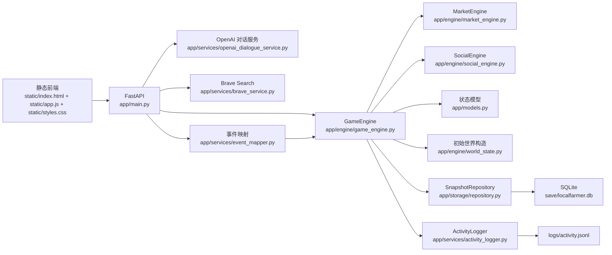

# GeoAI Pixel Lab 技术架构报告

## 1. 系统定位

`GeoAI Pixel Lab Test (UrbanComp Lab)` 是一个本地运行的多智能体社会仿真系统。它把以下几类机制耦合在同一个持续演化的世界里：

- 像素地图与空间移动
- 多智能体日常生活、欲望、关系和记忆
- 玩家输入对话与观察模式
- 外部新闻、宏观调控与系统随机事件
- 股票市场、借贷、信用、实验室口碑与地下案件
- 任务推进、GeoAI 研究与每日晨报

系统的核心价值不在单次问答，而在“一个会自己运转、自己积累后果的世界”。

## 2. 总体架构

整体仍然是单体应用，但内部已经形成几个相对清晰的子域：

- 世界仿真域
- 社交与记忆域
- 市场与金融域
- 地下案件域
- 外部事件域
- 前端观察与控制域

## 3. 分层结构

### 3.1 接入层

[app/main.py](/Volumes/Yaoy/project/LocalFarmer/app/main.py)

职责：

- 初始化 `GameEngine`
- 装配 OpenAI、Brave、快照仓储和日志器
- 暴露 API 并保存状态

当前关键接口：

- `GET /api/state`
- `POST /api/move`
- `POST /api/speak/{agent_id}`
- `POST /api/auto-speak/{agent_id}`
- `POST /api/advance`
- `POST /api/simulate`
- `POST /api/news`
- `POST /api/macro-news`
- `POST /api/player/trade`
- `POST /api/player/auto-trade`
- `POST /api/bank/borrow`
- `POST /api/bank/repay/{loan_id}`
- `POST /api/gray-cases/{case_id}/action`

### 3.2 领域模型层

[app/models.py](/Volumes/Yaoy/project/LocalFarmer/app/models.py)

核心模型包括：

- `WorldState`
- `Agent`
- `Player`
- `Task`
- `LabEvent`
- `DialogueOutcome`
- `DialogueRecord`
- `DailyBriefing`
- `MarketState`
- `IndexCandle`
- `LoanRecord`
- `BankState`
- `BankLoanRecord`
- `GrayCase`
- `SocialThread`
- `StoryBeat`

当前世界状态版本为 `22`。旧快照会在加载时补齐新字段；如果版本过旧，则丢弃并回到新的初始世界。

### 3.3 世界引擎

[app/engine/game_engine.py](/Volumes/Yaoy/project/LocalFarmer/app/engine/game_engine.py)

`GameEngine` 是系统实际运行的核心，负责：

- 世界推进与时段切换
- 玩家 / NPC 移动与碰撞
- 玩家与 NPC 对话
- NPC 环境互聊
- 欲望与计划刷新
- 每日刷新与回屋休息
- 市场波动、交易和借贷
- 宏观消息、系统新闻和随机实验室事件
- 地下案件升级、曝光与玩家处置
- 任务更新、研究里程碑、晨报生成
- 快照和日志写出

当前 `GameEngine` 已不再独占所有业务逻辑，而是主要承担编排职责，并把两块高频子域拆给：

- [app/engine/market_engine.py](/Volumes/Yaoy/project/LocalFarmer/app/engine/market_engine.py)
  - 市场视图准备
  - 盘中 tick
  - 玩家交易与自动交易
  - 市场事件冲击

- [app/engine/social_engine.py](/Volumes/Yaoy/project/LocalFarmer/app/engine/social_engine.py)
  - 玩家对话
  - NPC 互聊
  - 社交视图准备
  - 晨报与记忆同步

### 3.4 对话层

- [app/engine/dialogue_system.py](/Volumes/Yaoy/project/LocalFarmer/app/engine/dialogue_system.py)
  - 本地 fallback
  - 欲望驱动式短对话

- [app/services/openai_dialogue_service.py](/Volumes/Yaoy/project/LocalFarmer/app/services/openai_dialogue_service.py)
  - 玩家主动对话优先调用 `gpt-5-mini`
  - 观察模式下自动发言也优先走同一条链路
  - Prompt 注入角色记忆、主欲望、局部视角、财务压力和关系语境

### 3.5 外部事件层

- [app/services/brave_service.py](/Volumes/Yaoy/project/LocalFarmer/app/services/brave_service.py)
  - 搜索外部新闻

- [app/services/event_mapper.py](/Volumes/Yaoy/project/LocalFarmer/app/services/event_mapper.py)
  - 把 Brave 结果映射成市场事件
  - 把玩家宏观调控输入映射成方向、强度、板块明确的事件

## 4. 单一世界状态设计

系统以 `WorldState` 作为唯一真相源。

`WorldState` 主要包含：

- 时间：`day / time_slot / weather`
- 玩家与所有 Agent
- 活动任务与归档任务
- 最近事件
- 市场状态
- 借贷记录
- GeoAI 研究累计值与里程碑
- 社交线程与故事线
- 最近对话与 `dialogue_history`
- `daily_briefings`
- `gray_cases`

优点：

- 前端读取简单
- 快照恢复直接
- 调试时可完整查看系统状态

代价：

- 状态包会持续变大
- 全量重绘成本高
- 不适合高并发多人协作

当前阶段，这个权衡仍然合理。

## 5. 智能体架构

### 5.1 Agent 结构

每个 Agent 同时具有以下层次：

1. 身份层
- 中文名
- 角色
- 专长
- 人设

2. 数值状态层
- 心情
- 压力
- 专注
- 体力
- 好奇心
- GeoAI 推理值
- 知识储备

3. 社交层
- 关系值
- 盟友
- 对手
- 口碑感知
- 当前合作或冲突姿态

4. 记忆叙事层
- 短期记忆
- 长期记忆
- `memory_stream`
- 即时意图
- 当前活动
- 最近互动
- 状态摘要

5. 财务层
- 现金
- 持仓
- 风险偏好
- 金钱欲望
- 慷慨度
- 信用值
- 金钱压力

6. 生活层
- 小屋位置
- 是否休息
- 何时醒来

### 5.2 中文名迁移

系统当前默认 5 个角色全部使用中文名：

- 林澈
- 米遥
- 周铖
- 芮宁
- 凯川

兼容层会把旧快照里的英文名、旧小屋名、旧事件文本和部分历史对话自动本地化，确保状态迁移后仍然连续。

### 5.3 欲望驱动

角色不再仅仅依赖“风格标签”说话，而是先根据状态推导当前主欲望。

典型主欲望包括：

- 恢复体力
- 缓解钱压
- 抓住市场机会
- 守住边界
- 被接住
- 证明自己
- 把话讲清
- 照顾别人

这套欲望同时影响：

- 玩家对话回复
- NPC 互聊
- 联盟与冲突
- 借贷与交易倾向
- 地下行为触发概率

## 6. 世界推进机制

### 6.1 模拟循环

`simulate_world()` 的主要流程可以概括为：

1. 刷新市场时钟
2. 刷新角色计划与即时意图
3. 更新盘中市场波动
4. 生成系统新闻
5. 生成随机实验室事件
6. 推进地下案件
7. NPC 自主移动
8. NPC 自动交易
9. NPC 环境对话
10. 合作 / 冲突 / 调停事件
11. 借贷结算
12. 老化社交线程与故事线
13. 刷新任务、里程碑和晨报
14. 写入日志与快照

### 6.2 观察模式

观察模式下，玩家从“直接操作者”切换为“外部观察者”：

- 自动移动
- 自动发言
- 自动交易
- 自动推进时段
- 你主要负责注入外部信息和宏观消息

### 6.3 系统运行开关

前端的“系统运行：开 / 暂停”本质上是自动模拟的总开关。

暂停后会冻结：

- 自动模拟 tick
- 观察模式自动行动
- 自动交易
- 自动推进

但仍保留：

- 手动对话
- 手动交易
- 宏观调控
- 看盘与查看历史

## 7. 前端架构与功能模块

### 7.1 页面结构

当前页面被分成两个独立列：

- 左侧 `main-column`
  - 地图主舞台
  - 市场中心
  - 实验室主面板

- 右侧 `action-rail`
  - 任务进展
  - 玩家对话
  - 实时对话
  - Lab Daily
  - 信号终端
  - 地下案件处置台
  - 最近事件

这个拆法的目的，是让右侧信息流不再把左侧主舞台挤出大片空白。

### 7.2 市场中心

股票相关内容被集中到同一块模块中，避免此前“市场、任务、实验室指标混在一起”的混乱感。

市场中心当前包含：

- 大盘 `时K / 日K`
- 宏观调控台
- 板块轮动说明
- 个股卡片
- 玩家交易
- 银行借贷
- 玩家与智能体持仓 / 资金分布

当前布局已经被重新整理为：

- 左侧主列：K 线、宏观调控台、持仓与资金分布
- 右侧操作列：盘面总览、玩家交易、银行借贷

### 7.3 实时对话区

对话区已经从“整段文本硬铺开”改成结构化卡片。每条记录展示：

- 参与人
- 时间
- 话题
- 要点
- 欲望标签
- 借贷 / 灰色交易标签

并支持：

- 按人物筛选
- 只看借贷
- 只看灰色交易
- 只看欲望冲突
- 展开详情状态保持
- 滚动位置保持

## 8. 经济系统详解

### 8.1 经济系统组成

经济系统由六层组成：

1. 股票市场
2. 市场阶段
3. 板块轮动
4. 玩家 / Agent 交易
5. 银行借贷与信用
6. 人际借贷
7. 地下案件与实验室口碑

这些层不是彼此独立的，而是共同作用于 `MarketState`、团队现金、角色欲望和社交结构。

### 8.2 市场基础对象

`MarketState` 主要包含：

- `sentiment`
- `tick`
- `regime`
- `regime_age`
- `rotation_leader`
- `rotation_age`
- `index_value`
- `stocks`
- `index_history`
- `daily_index_history`

这意味着市场不再只是一个价格列表，而是一个带周期、板块主线和跨天轨迹的状态机。

### 8.3 三种市场阶段

#### 牛市

- 基础漂移偏正
- 利好消息放大
- 利空冲击被缓冲
- `GEO / SIG` 更容易领跑

#### 震荡市

- 上下波动接近均衡
- 主线更容易切换
- `AGR` 更容易获得相对收益

#### 风险市

- 基础漂移偏负
- 利空放大
- 正面消息折损
- `AGR` 更容易防守，`SIG` 更容易承压

市场阶段带有惯性，通常通过收益、情绪和持续时间共同决定切换，不会每轮随机跳变。

### 8.4 板块轮动

当前有三条板块：

- `GEO`
- `AGR`
- `SIG`

`rotation_leader` 表示当前主线板块，`rotation_age` 表示主线已持续天数。

主线板块会获得：

- 盘中漂移加成
- 利好放大
- 系统新闻更高概率点名

非主线板块则更容易出现：

- 跟涨
- 补涨
- 补跌

### 8.5 价格更新机制

单只股票的价格更新是多因子叠加的结果：

- 市场阶段漂移
- 情绪漂移
- 天气偏置
- 板块偏置
- 当前主线偏置
- 均值回归
- 延伸后的技术性回撤
- 托底保护
- 随机冲击

因此市场既不是纯随机数，也不会变成单边只涨。

### 8.6 事件冲击

进入市场的事件目前主要来自四条路径：

1. Brave 搜索映射的外部新闻
2. 玩家手动发布的宏观调控消息
3. 系统自动生成的市场新闻
4. 研究里程碑、地下案件曝光、随机实验室事件

每条事件都可以明确携带：

- 标题
- 摘要
- 正负方向
- 强度
- 目标板块

最终进入 `GameEngine` 后，对大盘和个股产生差异化冲击。

### 8.7 玩家交易

玩家支持：

- 手动买入
- 手动卖出
- 一键全卖
- 自动交易
- 地下案件驱动的做空

玩家账户当前还包含：

- 可用资金
- 多头持仓
- 空头持仓 `short_positions`
- 空头均价

### 8.8 智能体交易

每个 Agent 是否交易以及买什么，受以下因素共同驱动：

- 风险偏好
- 金钱压力
- 现金余量
- 持仓盈亏
- 市场阶段
- 当前主线板块
- 外部新闻

白天大约 10% 的行为时间会用于交易，其余大部分仍然是日常生活和社交。

### 8.9 借贷、信用与实验室口碑

借贷规则：

- 必须在对话中明确说出借钱、给钱、报销、利率或归还意图
- 默认次日归还
- 利息由借款方提出

信用值的作用已经超出金融风控：

- 决定是否愿意出借
- 影响合作意愿
- 影响信息共享
- 影响对灰色行为的容忍度

实验室口碑则是更高层的社会变量，会受以下事件影响：

下行：

- 灰色交易
- 地下案件曝光
- 压消息
- 负面宏观和系统新闻

上行：

- 任务完成奖励
- 借款按时还清
- GeoAI 研究里程碑
- 地下案件平稳收尾
- 每日晨间的自然恢复

口碑又会反向影响：

- 借贷通过率
- 合作与信息支持
- 事件冲击的市场放大方式

### 8.10 银行借贷系统

除了人与人之间的借贷，系统还引入了一个显式机构：`青松合作银行`。

核心对象：

- `BankState`
- `BankLoanRecord`

银行侧维护：

- 流动性 `liquidity`
- 基准日利率 `base_daily_rate_pct`
- 风险溢价 `risk_spread_pct`
- 累计放款
- 累计回款
- 历史违约次数

借款侧维护：

- 借款人类型：`player / agent`
- 本金
- 日利率
- 总利率
- 应还金额
- 起始日
- 到期日
- 天期
- 状态：`active / overdue / repaid`

#### 银行利率形成

银行当前报价不是固定常数，而是由以下因素叠加：

1. 基准日利率
2. 市场阶段调整
3. 借款天数溢价
4. 个人信用溢价
5. 实验室口碑调整
6. 银行自身流动性与违约压力形成的风险溢价

这意味着：

- 牛市和高信用时，报价更低
- 风险市、低口碑、低流动性和高违约时，报价更高

#### 银行授信

系统当前按信用值给出授信上限，大致分层为：

- 高信用：更高额度
- 中信用：中等额度
- 低信用：明显收紧

同时银行限制同一借款人并发未结清贷款数量，并会在存在逾期时直接拒绝继续放款。

#### 银行自动行为

智能体不只是被动展示数字，而会真实参与银行系统：

- 现金和体力都偏紧时，可能主动向银行借款
- 有逾期时，在现金允许下会尝试补还

#### 银行与其它系统的耦合

银行借贷会继续影响：

- 玩家和智能体现金
- 信用值
- 实验室口碑
- 金钱欲望和即时意图
- 对话记录
- 市场中心前端展示

提前部分还款会保持贷款为正常 `active` 状态，不会错误进入逾期分支；真正逾期时才会触发罚息和信用惩罚。

### 8.11 地下案件系统

地下案件不是一次性标签，而是带生命周期的对象。

当前支持的类型包括：

- 内幕倒卖
- 假报销
- 数据窃取
- 封口费
- 模糊承诺诈骗
- 私下交换

案件从生成到结束通常经历：

1. 生成
2. 暗中发酵
3. 追债 / 报复 / 反咬一口等升级
4. 曝光或平稳收尾

玩家可以主动处置：

- 压消息
- 举报
- 和解
- 借机做空

一旦曝光，系统会：

- 生成公开新闻事件
- 拖累市场情绪
- 影响相关股票
- 拉低实验室口碑
- 写入角色长期记忆

### 8.12 系统新闻与随机实验室事件

系统每天并不完全依赖玩家输入。

两类自动扰动已经接入：

#### 系统新闻

- 来源：`系统新闻台`
- 偏向经济、政策和板块逻辑
- 直接进入市场事件流

#### 随机实验室事件

- 来源：`系统奇遇`
- 更偏运营、校园、设备、合作和误传
- 直接作用于：
  - 团队现金
  - 实验室口碑
  - 团队氛围
  - 研究推进
  - 板块和个股

这使市场和实验室资金不再只由交易决定，而是会受到经营层面的随机扰动。

## 9. 任务、研究与晨报

### 9.1 任务系统

主任务当前已经转成团队总现金增长逻辑，科研只保留为较轻的支线。

任务支持：

- 实时刷新
- 达成即归档
- 归档历史可显示
- 奖励正式结算到实验室指标中

### 9.2 GeoAI 研究

GeoAI / 空间智能进度不再封顶，而是持续累加。

当研究跨过里程碑时，系统会：

- 生成研究新闻
- 提升实验室口碑
- 提升 `GEO` 相关股票
- 写入角色记忆

### 9.3 Lab Daily

每天早晨系统会生成一份 `Lab Daily` 晨报，总结前一天的：

- 市场表现
- 板块主线
- 借贷和地下案件
- 人际风波与八卦
- 研究与故事线

晨报对象为 `DailyBriefing`，会被：

- 存入 `daily_briefings`
- 展示在前端右侧
- 同步写入所有角色的长期记忆和 `memory_stream`

## 10. 日志与持久化

### 10.1 快照

[app/storage/repository.py](/Volumes/Yaoy/project/LocalFarmer/app/storage/repository.py)

使用 SQLite 保存整包 `WorldState`。

优点：

- 恢复简单
- 便于单机调试
- 快速迭代

限制：

- 不适合高并发多人场景
- 不适合事件溯源级别重放

### 10.2 行为日志

[app/services/activity_logger.py](/Volumes/Yaoy/project/LocalFarmer/app/services/activity_logger.py)

日志写入 [logs/activity.jsonl](/Volumes/Yaoy/project/LocalFarmer/logs/activity.jsonl)，包括：

- 玩家移动
- NPC 自主移动
- 玩家对话
- NPC 环境互聊
- 市场交易
- 借贷与还款
- 地下案件升级、曝光与处置
- 系统新闻与宏观调控
- 随机实验室事件
- 每日刷新与晨报生成
- 世界模拟 tick

这些日志既是调试材料，也能作为后续行为分析与回放的基础。

## 11. 配置与安全策略

- 真实密钥不进入仓库
- 默认从 `/tmp/localfarmer.env` 读取
- `.env.example` 只保留空占位
- 默认模型为 `gpt-5-mini`

这是本地开发友好的 secrets 策略，但不是生产环境方案。

## 12. 当前优势

- 单一世界状态让调试和持久化简单直接
- 社交、市场、借贷、口碑和灰色案件已经形成闭环
- 既支持玩家直接操作，也支持纯观察玩法
- 市场不再是简单随机数，而是有阶段、轮动和事件冲击结构
- 研究、任务、晨报和市场能互相传导

## 13. 当前限制

### 13.1 `GameEngine` 过重

它已经同时承担：

- 社交
- 市场
- 借贷
- 每日作息
- 任务
- 地下案件
- 事件调度

后续最好拆出：

- `market subsystem`
- `social subsystem`
- `daily-life subsystem`
- `case subsystem`
- `orchestration subsystem`

### 13.2 前端单文件仍然过大

[static/app.js](/Volumes/Yaoy/project/LocalFarmer/static/app.js) 依然承担过多职责，后续更适合拆为：

- `renderer`
- `market-panels`
- `dialogue-panels`
- `controls`
- `api`

### 13.3 仍是全量状态拉取

虽然简单，但未来会带来：

- 状态包持续膨胀
- 局部刷新困难
- 对话区和历史区需要更多前端状态保持逻辑

## 14. 后续建议

最值得继续推进的方向：

1. 给玩家交易补平仓盈亏、委托单、止盈止损
2. 给地下案件补证据链和多回合调查
3. 把市场和社交从 `GameEngine` 进一步拆模块
4. 给 Lab Daily 增加可点击跳转到相关事件
5. 做增量状态更新，降低前端重绘成本

## 15. 结论

当前版本已经不是“会聊天的像素实验室”，而是一个带社会关系、市场周期、借贷信用、实验室经营、研究里程碑和地下案件链条的多智能体世界。

系统最核心的价值，是它已经形成了可持续演化的闭环：

- 世界自己运行
- 角色自己积累欲望和后果
- 市场自己波动并响应新闻
- 玩家既能直接参与，也能从更高层面调控世界
