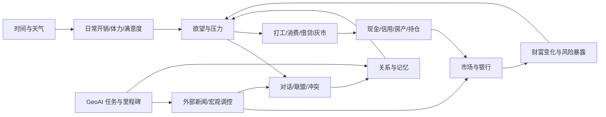

# GeoAI Pixel Lab 系统运作说明

副标题：一份面向本科生的多智能体社会经济仿真解释稿

## 1. 这套系统到底是什么

`GeoAI Pixel Lab` 不是一个普通聊天机器人，也不是一个单纯的小游戏。它更像一个“可运行的小社会”：

- 里面有多个会行动、会记忆、会交流的智能体
- 智能体生活在同一张地图里
- 他们会工作、消费、借钱、炒股、买房、结盟、冲突
- 外部新闻、宏观消息、天气、市场波动会持续影响他们
- 玩家既可以亲自参与，也可以切到观察模式，只做外部干预

因此，这套系统最核心的特征不是“某一句回复像不像人”，而是：

`很多简单规则叠加后，会不会自己长出复杂行为。`

这就是多智能体仿真的核心价值。

## 2. 什么是智能体

### 2.1 定义

在这个系统里，智能体（Agent）可以理解成：

`一个有状态、有记忆、有目标、能感知环境并作出行动决策的计算实体。`

它不是固定台词的 NPC，也不是只会问答的聊天框。

一个智能体至少包含 5 类信息：

1. 身份信息
- 名字
- 角色
- 专长
- 说话风格

2. 内部状态
- 心情
- 压力
- 体力
- 专注
- 好奇心
- 生活满意度

3. 社会状态
- 和谁关系好
- 和谁紧张
- 最近和谁说过话
- 有没有借贷、冲突、联盟

4. 经济状态
- 现金
- 信用
- 股票持仓
- 借款
- 房产

5. 记忆与欲望
- 短期记忆：最近发生了什么
- 长期记忆：持续影响行为的事件
- 当前欲望：现在最想解决什么问题

所以，一个智能体不是“回答器”，而是“带内部状态的决策者”。

### 2.2 智能体和普通角色的区别

普通游戏角色通常是：

- 预设路径
- 预设台词
- 预设触发器

而这里的智能体更像：

- 根据现金压力决定要不要打工
- 根据关系和信用决定借不借钱
- 根据天气、时段和心情决定想聊什么
- 根据外部新闻决定买卖股票
- 根据地下案件决定压消息还是举报

也就是说，它们有“条件驱动的行为生成能力”。

## 3. 什么是 GeoAI

### 3.1 简单定义

GeoAI 是 `Geospatial Artificial Intelligence`，中文通常叫：

`地理空间人工智能` 或 `空间智能`

它强调的是：

- 数据不是抽象数字，而是带空间位置的
- 问题不是纯文本推理，而是和地图、区域、流动、空间模式有关

例如：

- 某个区域的人流为什么突然上升？
- 城市里哪些区域更容易形成热点？
- 农田、湖边、道路和建筑之间的空间关系会带来什么影响？

### 3.2 在这个系统里的 GeoAI 是什么

在 `GeoAI Pixel Lab` 里，GeoAI 不是一个真的遥感科研平台，而是一个“研究主题和能力变量”：

- 实验室有 `geoai_progress`
- 智能体有 `geo_reasoning_skill`
- 外部新闻和研究任务会推动 GeoAI 里程碑
- 里程碑会反过来影响实验室口碑、新闻和市场板块

所以，这里的 GeoAI 更像：

`一个把研究系统、新闻系统、任务系统和市场系统连接起来的主题主线。`

## 4. 什么是智能体行为的涌现

### 4.1 定义

涌现（Emergence）指的是：

`系统整体表现出一些复杂现象，但这些现象并不是直接写死的，而是由很多局部规则相互作用自然产生的。`

### 4.2 一个直观例子

系统里并没有硬编码：

- “第 100 天之后一定会形成资产阶层”
- “某个角色一定会长期贫困”
- “大家一定会因为现金紧张去打工”

但如果有这些局部规则：

- 现金低于阈值会去公司打工
- 有钱的人更容易买房
- 房产每天带来收益和舒适度
- 信用差的人借款更难
- 地下交易会损伤口碑
- 新闻会影响市场和情绪

那么运行一段时间后，就可能自然出现：

- 有人越来越有钱
- 有人越来越依赖借贷
- 有人因为压力高走向灰色交易
- 有人因为满意度高而减少极端行为

这些现象就是“涌现”。

### 4.3 为什么涌现重要

因为如果系统只会执行写死的剧情，它只是“演示软件”。

只有当局部规则足够丰富，并且规则之间会互相反馈，系统才会变成：

`一个可研究、可观察、可解释的复杂系统。`

## 5. 为什么经济规律是底层运作机制

这是理解这套系统最关键的一点。

很多人会直觉上觉得：

- 这个系统的表层是聊天
- 中层是关系
- 深层是研究任务

但真正更底层的，是经济约束。

### 5.1 经济变量为什么是底层

因为经济变量同时约束了几乎所有行为：

- 现金不足时，必须打工
- 信用过低时，借不到钱
- 房价和消费提高后，生活满意度会受影响
- 口碑变差会抬高银行风险溢价
- 新闻会影响股市
- 股市涨跌影响财富和情绪
- 财富再反过来影响消费、社交和风险偏好

也就是说，经济不是“一个附加模块”，而是：

`把生活、社交、研究、市场、新闻和行为压力串起来的底层约束系统。`

### 5.2 一个更简单的理解

如果没有经济机制，智能体可以无限聊天、无限探索、无限维持状态。

一旦加入经济机制：

- 他们要为生活付费
- 要面对通胀
- 要在工作、消费、投资之间分配资源
- 要承担错误决策的后果

这时，系统才有“稀缺性”。

而稀缺性，正是大多数真实社会行为的起点。

## 6. 系统里有哪些主要子系统

这套系统可以拆成 8 个主要子系统。

## 6.1 空间与地图系统

负责：

- 地图绘制
- 区域划分
- 障碍碰撞
- 房屋、公司、地产、角色显示
- 相机移动和缩放

它决定了：

- 谁能走到哪里
- 谁容易相遇
- 哪些地点有功能差异

空间不是背景，而是行为发生的舞台。

## 6.2 时间与天气系统

负责：

- 天数推进
- 上午/中午/下午/傍晚/夜晚切换
- 天气变化
- 夜晚回屋休息
- 每日结算

它决定了：

- 智能体何时出门
- 何时打工
- 何时回家
- 晨报何时生成
- 每日开销何时扣除

## 6.3 智能体状态与记忆系统

负责：

- 心情、压力、体力、满意度等状态
- 短期记忆
- 长期记忆
- Memory Stream
- 当前欲望和即时意图

它决定了：

- 智能体现在更想做什么
- 为什么说这句话
- 为什么对同一件事反应不同

## 6.4 社交与对话系统

负责：

- 玩家和智能体的对话
- 智能体之间的互聊
- 关系变化
- 欲望冲突
- 联盟和对抗

它决定了：

- 谁和谁更亲近
- 谁和谁更敌对
- 对话是不是只停留在表层寒暄

## 6.5 研究与任务系统

负责：

- GeoAI 主线推进
- 支线任务
- 任务归档
- 里程碑生成

它决定了：

- 系统有没有长期目标
- 研究成果何时转化成新闻和市场影响

## 6.6 市场与金融系统

负责：

- 股票价格和指数
- 时 K / 日 K
- 市场阶段：牛市 / 震荡市 / 风险市
- 板块轮动
- 玩家和智能体买卖股票

它决定了：

- 财富如何波动
- 外部新闻如何进入经济
- 不同角色如何承担风险

## 6.7 借贷、信用与银行系统

负责：

- 人际借贷
- 银行贷款
- 动态利率
- 信用下降与违约
- 实验室口碑联动

它决定了：

- 谁在缺钱时还能维持运转
- 谁会被系统边缘化

## 6.8 生活、消费、地产与劳动系统

负责：

- 日开销
- 生活满意度
- 消费目录
- 地产买卖
- 房租、收益、维护费
- 公司打工和工资
- 通胀压力

它决定了：

- 经济活动为什么持续发生
- 角色为什么不能一直只聊天不谋生

## 7. 系统之间是怎么联动的

可以把整个系统理解成一个反馈回路网络。

这张图表达的是：

- 时间推进后，会触发体力、开销和满意度变化
- 这些变化会改变欲望和压力
- 欲望和压力会驱动社交、劳动、消费、投资和借贷
- 经济后果又会反过来改变欲望和关系
- 外部新闻和研究里程碑会继续扰动市场和社交

所以系统不是“直线流程”，而是“多反馈回路并行”。

## 8. 系统内部是怎么运行的

可以把一次运行周期理解成下面 7 步。

## 8.1 第一步：读取当前世界状态

系统从 `WorldState` 读取：

- 当前第几天、什么时段、什么天气
- 所有人在哪里
- 每个人有多少钱、什么心情、什么记忆
- 市场、银行、口碑、任务处于什么状态

## 8.2 第二步：刷新约束

系统会先更新一批“底层约束”：

- 通胀
- 日开销压力
- 体力恢复或下降
- 是否要回屋休息
- 是否到了需要打工的现金阈值

## 8.3 第三步：计算欲望和计划

每个智能体会根据当前状态形成主欲望，例如：

- 想缓解钱压
- 想恢复体力
- 想证明自己
- 想抓住市场机会
- 想被理解

然后生成一个当前计划：

- 去打工
- 去找某人聊天
- 去借钱
- 去买股票
- 去休息

## 8.4 第四步：执行行动

行动可能是：

- 移动
- 说话
- 交易
- 消费
- 借贷
- 买房
- 发起灰色交易

## 8.5 第五步：结算后果

行动执行后，系统会更新：

- 现金
- 信用
- 满意度
- 压力
- 关系
- 记忆
- 市场价格
- 口碑

## 8.6 第六步：写入事件流

每个重要行为都会写成事件，例如：

- 对话记录
- 经济事件流
- 最近事件
- 地下案件
- 晨报素材

## 8.7 第七步：进入下一轮

下一轮再用更新后的状态继续运行。

所以本质上，这是一个：

`状态 -> 决策 -> 行动 -> 后果 -> 新状态`

的循环系统。

## 9. 为什么“人物会活起来”

如果只有大语言模型，角色往往只是“说得像人”。

而在这个系统里，角色更像活人，是因为同时满足了 4 个条件：

1. 有持续记忆
2. 有资源约束
3. 有空间位置
4. 有长期后果

比如一个角色今天因为缺钱去借贷，明天没还上，信用下降，后天银行不再愿意借，接着只能打工或走灰色渠道。这样一来，他的下一句对话就不只是语言风格问题，而是由真实处境决定的。

## 10. 一个简化的数学建模版本

为了便于本科生理解，可以把这套系统看成一个离散时间动力系统。

设第 $t$ 时刻，智能体 $i$ 的状态为：

\[
S_i(t) = [m_i, s_i, e_i, c_i, q_i, r_i, x_i, p_i, d_i, h_i]
\]

其中：

- $m_i$：心情
- $s_i$：压力
- $e_i$：体力
- $c_i$：现金
- $q_i$：信用
- $r_i$：关系向量
- $x_i$：空间位置
- $p_i$：持仓/房产等资产
- $d_i$：主欲望
- $h_i$：记忆状态

整个世界状态为：

\[
W(t) = [S_1(t), S_2(t), ..., S_n(t), M(t), B(t), L(t), E(t)]
\]

其中：

- $M(t)$：市场状态
- $B(t)$：银行状态
- $L(t)$：实验室状态
- $E(t)$：事件集合

## 10.1 欲望函数

可以把主欲望写成一个打分函数：

\[
D_i(t) = \arg\max_k \; U_{ik}(t)
\]

其中 $U_{ik}(t)$ 是第 $i$ 个智能体在时刻 $t$ 对第 $k$ 种欲望的强度。

例如，缓解钱压的欲望可以写成：

\[
U^{money}_i(t) = a_1 \cdot \max(0, 50 - c_i(t)) + a_2 \cdot \text{Debt}_i(t) + a_3 \cdot \text{Inflation}(t)
\]

解释：

- 现金越低，金钱欲望越强
- 债务越高，金钱欲望越强
- 通胀越高，金钱欲望越强

恢复体力的欲望可以写成：

\[
U^{rest}_i(t) = b_1 \cdot (100 - e_i(t)) + b_2 \cdot \text{Night}(t)
\]

## 10.2 行动选择

给定主欲望后，行动集合为 $A_i(t)$，系统选择最大期望收益的动作：

\[
a_i^*(t) = \arg\max_{a \in A_i(t)} \mathbb{E}[R_i(a, t)]
\]

这里的收益 $R_i$ 不只是金钱，而是综合收益：

\[
R_i = \alpha \cdot \Delta c_i + \beta \cdot \Delta m_i - \gamma \cdot \Delta s_i + \delta \cdot \Delta r_i + \eta \cdot \Delta e_i
\]

意思是：

- 有的动作赚现金
- 有的动作提高心情
- 有的动作降低压力
- 有的动作改善关系
- 有的动作恢复体力

## 10.3 市场更新

市场指数可以简化写成：

\[
I(t+1) = I(t) + \mu_{regime} + \phi \cdot News(t) + \psi \cdot Macro(t) + \epsilon_t
\]

其中：

- $\mu_{regime}$：由牛市/震荡市/风险市决定的漂移项
- $News(t)$：新闻冲击
- $Macro(t)$：玩家宏观调控
- $\epsilon_t$：随机扰动

## 10.4 通胀与生活成本

通胀指数可以简化写成：

\[
P(t+1) = P(t) + \lambda_1 \cdot CashPressure(t) + \lambda_2 \cdot MarketHeat(t) + \lambda_3 \cdot DayTrend(t)
\]

生活成本则近似为：

\[
Cost_i(t) = Base_i \cdot \frac{P(t)}{100} + \omega \cdot Pressure(t)
\]

这解释了为什么后期通胀会逼出更多打工、借贷和灰市行为。

## 10.5 关系更新

关系可以写成：

\[
r_{ij}(t+1) = r_{ij}(t) + \theta_1 \cdot Help_{ij}(t) - \theta_2 \cdot Conflict_{ij}(t) + \theta_3 \cdot SharedMemory_{ij}(t)
\]

即：

- 帮助会提升关系
- 冲突会降低关系
- 一起经历事件会形成共享记忆，进而改变关系

## 10.6 涌现的形式化理解

当世界按照下面的迭代运行时：

\[
W(t+1) = F(W(t), \xi_t)
\]

其中：

- $F$ 是系统规则
- $\xi_t$ 是随机事件、新闻、天气、玩家输入

如果长期运行后，系统出现了宏观模式，例如：

- 财富集中
- 信用分层
- 社会联盟
- 房地产扩张
- 地下经济活跃

而这些模式并没有被直接编码为单个规则目标，那么它们就是涌现结果。

## 11. 为什么适合给本科生讲

这套系统很适合教学，因为它把多个抽象概念放进了一个可视、可运行的环境里：

- 人工智能：智能体如何决策
- 地理信息：空间如何影响行为
- 复杂系统：局部规则如何生成整体模式
- 经济学：稀缺、通胀、信用、投资、劳动如何约束行为
- 社会学：关系、联盟、冲突和舆论如何传播

对于本科生来说，最重要的不是记住所有接口，而是理解下面这句话：

`一个复杂系统的宏观现象，往往不是从“一个大规则”里长出来的，而是从很多小规则彼此耦合、长期反馈中慢慢长出来的。`

## 12. 可以怎么向本科生总结

如果只用几句话来总结，可以这样讲：

1. 这是一个多智能体社会仿真系统，每个角色都不是死的 NPC，而是有状态、有记忆、有欲望的行动者。
2. GeoAI 是这个世界里的研究主线，它连接了任务、新闻、市场和实验室口碑。
3. 系统最重要的科学问题不是“谁说了什么”，而是“为什么这些角色在长期运行后会形成联盟、分化、贫富差距和地下经济”。
4. 经济规律之所以是底层机制，是因为现金、信用、通胀、借贷、劳动和消费共同决定了绝大多数行为约束。
5. 这套系统真正有趣的地方在于涌现：很多宏观现象没有被写死，但在规则互动中自然出现。

## 13. 如果要继续深入

如果要给本科生继续往下讲，可以延伸 3 个方向：

1. 把它讲成 ABM（Agent-Based Modeling）案例
- 强调局部规则和宏观模式

2. 把它讲成 GeoAI 应用案例
- 强调空间、区域、移动和环境影响

3. 把它讲成复杂经济系统案例
- 强调劳动、信用、市场、资产和地下经济的耦合

---

如果要做课堂展示，建议按这个顺序讲：

1. 先讲“智能体是什么”
2. 再讲“为什么会涌现”
3. 再讲“经济为什么是底层约束”
4. 最后用地图和实时分析面板演示系统如何自己运转
